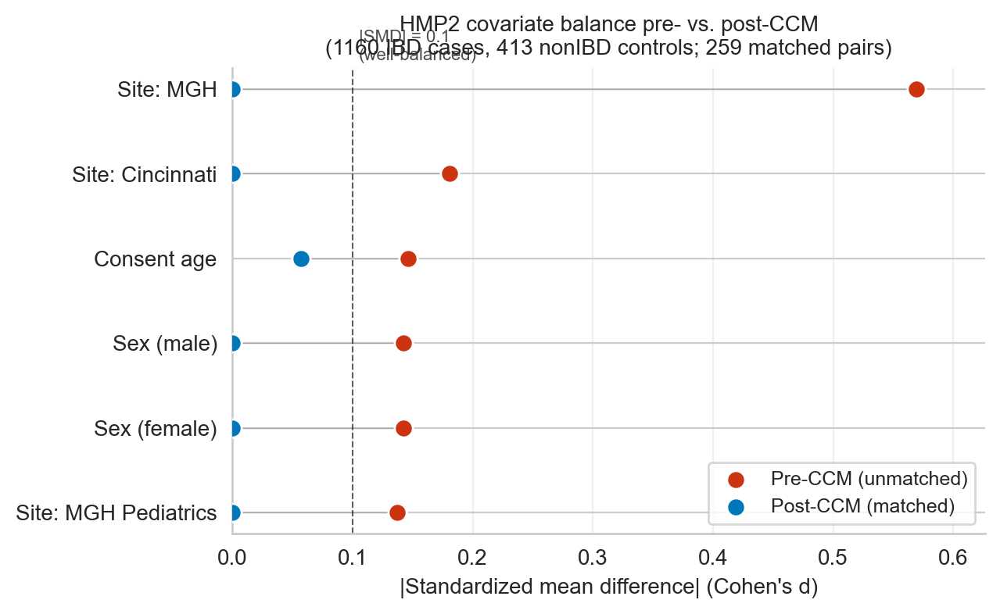

# Qupid: A Framework for Multiple Case-Control Matching in Microbiome Studies

Leo Joseph1,4, Lucas Patel1,5,6, Gibraan Rahman1,2, Rob Knight1,2,3,4*

1Department of Pediatrics, University of California San Diego, La Jolla, CA, USA
2Center for Microbiome Innovation, University of California San Diego, La Jolla, CA, USA
3Department of Computer Science and Engineering, University of California San Diego, La Jolla, CA, USA
4Department of Bioengineering, University of California San Diego, La Jolla, CA, USA
5Medical Scientist Training Program, University of California San Diego, La Jolla, CA, USA
6Bioinformatics and Systems Biology Program, University of California San Diego, La Jolla, CA, USA

*Correspondence: robknight@ucsd.edu

## Abstract

Case-control matching (CCM) reduces confounding in microbiome studies, but it is not unique: when many controls qualify for each case, the choice between them is arbitrary, and a single matched set hides the variability of any downstream inference drawn from it. We present Qupid, a Python package and QIIME 2 plugin that generates and statistically evaluates hundreds of valid case-control matchings rather than committing to one. Qupid builds the case-to-valid-control bipartite graph once and re-samples it with a randomized maximum-cardinality algorithm, so producing a hundred matchings on cohorts of thousands of samples runs in seconds — orders of magnitude faster than legacy tools (SPSS FUZZY) and severalfold faster than current best-practice host-covariate matchers (MatchIt, R Matching, CEM, q2-matchmaker). Applied to three cohorts — American Gut Project (AGP) IBD; Human Microbiome Project 2 (HMP2) IBD; and THDMI, where we follow Khatib et al. in defining "unhealthy" as participants reporting at least one of nine self-reported chronic conditions — Qupid surfaces three different behaviours that a single matching would conceal, evaluated using Bray-Curtis dissimilarity (AGP) or DartUniFrac (Zhao et al., 2026) — a fast, scalable implementation of unweighted UniFrac against the Greengenes2 2024.09 reference phylogeny (HMP2 and THDMI). In AGP, the IBD signal sharpens once heterogeneity is removed from the large control pool. In HMP2, where matching draws a constrained, Crohn's-enriched subset of cases, effect-size estimates stabilise across iterations. In THDMI, the apparent unhealthy–microbiome association partially dissolves once participants are balanced on the demographic covariates that the THDMI study itself identified as the strongest microbiome drivers. By replacing one arbitrary matching with a distribution over valid matchings, Qupid lets researchers distinguish biological signal from artifacts of study design.

## Main

Microbiome case-control studies are commonly affected by confounding variables that can inflate or mask true biological effects (Vujkovic-Cvijin et al., 2020; Weiss et al., 2017). Confounding is hard to remove in microbiome data for several reasons: extreme sample size imbalances are common (for example, 27:1 control-to-case ratios in citizen-science cohorts such as AGP); multiple categorical and continuous covariates must be balanced simultaneously; and downstream beta-diversity inference is sensitive to both group size and the specific realization of matching, with PERMANOVA R2 in particular known to vary with group size and dispersion structure (Anderson, 2001; Kelly et al., 2015).

A wide range of matching and adjustment approaches have been developed to address confounding in observational data. Propensity score methods, optimal matching, and genetic matching are well established in epidemiology and have mature implementations in R, including MatchIt, optmatch, and cobalt (Austin, 2011; Ho et al., 2011; Greifer, 2024). Matching in microbiome studies has been discussed in the context of improving compositional comparisons (Brooks, 2016). Microbiome-specific tools have addressed confounding through covariate adjustment within linear models (MaAsLin2/3 (Mallick et al., 2021; Nickols et al., 2024), ANCOM-BC2 (Lin and Peddada, 2024)) or through batch correction (MMUPHin (Ma et al., 2022), ConQuR (Ling et al., 2022)). The recently developed miMatch tool (Liu et al., 2024) matches samples via propensity scores on inferred microbial metabolic background (principal components of metabolic pathway profiles), producing a single matched cohort — an indirect, microbiome-intrinsic approach distinct from direct host-covariate matching. These approaches typically return a single, deterministic matched set or a single adjusted estimate. Because the choice of which control to assign to each case is itself stochastic when multiple valid controls exist, a single matching can over- or underestimate the true effect, and current tools do not let researchers characterize the distribution of effect sizes that are compatible with a given set of matching constraints.

We developed Qupid to fill this gap. Qupid (1) identifies all valid controls for each case based on user-specified discrete and tolerance-based numeric criteria, (2) generates many one-to-one matchings from this valid-control graph using a randomized maximum-cardinality bipartite matching algorithm, and (3) statistically evaluates which matchings maximize separation between cases and controls using univariate or multivariate (PERMANOVA) tests. Qupid is implemented as a standalone Python package (`pip install qupid`) and as a QIIME 2 plugin, enabling integration with existing microbiome workflows (Bolyen et al., 2019).

## Results

### Qupid amortizes multi-matching for large cohorts

Qupid is designed to make multi-matching a routine step rather than a major time investment. For a typical microbiome cohort — a few hundred cases and a few thousand controls — Qupid produces a hundred valid case-control matchings in seconds on a laptop, fast enough that running an analysis with k = 100 matchings instead of k = 1 imposes no meaningful cost on the user. This speed comes from a single observation: although every matching may differ in which controls it assigns to which cases, all matchings draw from the same set of *valid* control candidates per case, fixed by the user's covariate criteria. Qupid spends its work identifying those candidates once, then resamples the assignment many times. Each resample uses a randomized variant of the Hopcroft–Karp maximum-cardinality bipartite matching algorithm (Hopcroft and Karp, 1973), so successive matchings differ from one another but still satisfy the user's constraints exactly.

A direct consequence is that constraints make Qupid faster, not slower: tightening the matching criteria from a single covariate to three covariates reduces wall-clock time at the AGP IBD configuration (169 cases, 4,672 controls) by an order of magnitude at k = 100, because a sparser candidate graph requires less work per resample. To verify that this speed advantage is not bought at the cost of correctness, we compared Qupid against two natural strategies for multi-matching — rebuilding the candidate graph from scratch every iteration, and caching the graph but assigning controls greedily without solving the matching problem — and find that the greedy baseline silently drops cases at tight matching configurations whereas Qupid recovers every case at every configuration tested (Supplementary Fig. 4).

### Qupid is faster than current matching tools and orders of magnitude faster than legacy ones

To position Qupid against the matching software that microbiome researchers currently use, we benchmarked it head-to-head against four widely used host-covariate matching tools — MatchIt (Ho et al., 2011), R `Matching` (Sekhon, 2011), CEM (Iacus et al., 2012), and q2-matchmaker, the QIIME 2 matching plugin introduced in Morton et al. (Morton et al., 2023) — on the AGP IBD cohort under the same matching constraints used elsewhere in this study (sex + age category + BMI category; 159 cases, 4,400 controls after dropping AGP missingness sentinels; Fig. 1a). Each external tool was invoked under its standard one-to-one configuration and looped k times to mimic a multi-matching workflow, because none provides a native multi-matching abstraction. We verified empirically that the deterministic tools are byte-identical across iterations under their default configurations; CEM in particular is fundamentally order-invariant (a single weighted stratification of all 4,559 units), so its k-curve illustrates the cost of repeated invocation rather than a recommended workflow.

Across the relevant range (k = 1 to 100), Qupid's wall-clock time grew sub-linearly with k while all four external tools scaled approximately linearly, with Qupid completing 100 matchings several-fold faster than the fastest external tool at k = 100 (exact numbers in Fig. 1a). For single-matching workflows the established tools remain competitive; Qupid's advantage is specific to the multi-matching regime (k ≳ 10), which is the use case it is designed for. The benchmark also reproduces the historical comparison of Patel et al. (Fig. 1b) on the Wisconsin 16S dementia–AD cohort, where SPSS FUZZY — still widely cited in the literature — exceeds 10⁴ s at k = 1,000 against qupid's < 1 s, an *order-of-magnitude* gap that motivates the "accessible multi-matching for large studies" framing throughout this paper. The microbiome-specific tool miMatch (Liu et al., 2024) was not included because it matches on principal components of inferred microbial metabolic background rather than host covariates and returns a single matched cohort with no iteration axis.

**Figure 1. Qupid amortizes multi-matching where established tools do not, and is orders of magnitude faster than legacy SPSS-based workflows.** Wall-clock time (log–log axes) vs. number of matched sets k. **(a)** New benchmark on the AGP IBD cohort (159 cases, 4,400 controls; sex + age category + BMI category, categorical matching), for Qupid (blue) and four widely used host-covariate matching tools: MatchIt (orange; `method="nearest"` with exact strata), R `Matching` (teal; `Match` 1:1 exact), CEM (red; coarsened exact matching), and q2-matchmaker (purple; Morton et al., 2023). Points are median of three runs. Qupid builds the case-to-valid-control bipartite graph once and re-randomizes the matching per iteration, so its runtime is near-flat in k; the four external tools have no native multi-matching capability and each scales linearly in k. **(b)** Historical benchmark from Patel et al. on the Wisconsin 16S dementia–AD cohort (sex + age ±4.5 yr) using SPSS FUZZY (red diamonds), R `Matching` (teal triangles), and Qupid (blue circles). SPSS FUZZY — still widely cited in the matching literature — exceeds 10⁴ s at k = 1,000 against Qupid's < 1 s. The two panels share axes for direct visual comparison of scale.

### Case-control matching (CCM) modestly increases the AGP IBD disease signal

We first evaluated Qupid on the American Gut Project (AGP) cohort, which contains 169 IBD cases diagnosed by a medical professional and 4,672 controls (1:27.6 imbalance ratio) — the kind of large, imbalanced citizen-science cohort that motivates accessible multi-matching software. Cases were matched to controls on sex, age category, and BMI category (all discrete) and downstream effect sizes were computed using **Bray-Curtis dissimilarity** (see Methods for metric selection rationale). To enable fair comparison of effect sizes before and after CCM, we controlled for sample size by bootstrap-subsampling the pre-CCM data to the post-CCM size (n = 169 cases + 169 controls = 338 samples per iteration, 100 iterations), since PERMANOVA R2 is sensitive to group-size imbalance. All 169 cases had complete metadata for the three matching covariates and were successfully matched in at least one of the 100 iterations (0 excluded; AGP_matched_vs_excluded.csv), so the post-CCM cohort represents the full case set with no case-selection bias introduced by matching.

Qupid matching produced significantly larger effect sizes for the IBD case-control comparison (Fig. 2a). Mean PERMANOVA R2 increased from 0.40 ± 0.07% (pre-CCM bootstrap) to 0.45 ± 0.08% (post-CCM), a 13% relative increase (p = 1.1 × 10⁻⁵, t-test). While these absolute effect sizes are modest, as is typical for microbiome studies in which any single covariate explains a small fraction of compositional variance, the consistent relative increase is consistent with heterogeneity in the large control pool attenuating the measured disease signal. Pre- and post-CCM effect sizes were highly correlated across all metadata categories (Pearson r = 0.995, p < 1 × 10⁻¹⁰; Fig. 2b), with the linear fit lying systematically above the identity line, confirming that matching increased effect sizes across covariates rather than only the case-control axis.

### CCM stabilizes effect size estimates in the HMP2 IBD cohort

We next applied Qupid to the Human Microbiome Project 2 (HMP2) cohort. HMP2 contained 1,179 IBD cases (Crohn's disease and ulcerative colitis combined) and 413 non-IBD controls (2.9:1 ratio). Cases were matched on sex, race, and site, plus consent age within ±5 years, using unweighted UniFrac distances computed against the Greengenes2 2024.09 reference phylogeny. Although HMP2 contained 1,179 cases in total, the matching constraints and the smaller control pool yielded 259 cases with valid matches per iteration, giving a balanced 259 + 259 = 518-sample dataset. To assess whether this matched subset is representative of the full case pool, we identified all cases appearing in at least one of the 100 matched iterations (268 unique cases across iterations, approximately 259 per iteration) and compared their clinical and demographic characteristics to the 911 excluded cases (Supplementary Table 2). We tested for differences using independent chi-square tests of independence on counts (`scipy.stats.chi2_contingency`) and two-sided Mann–Whitney U tests (`scipy.stats.mannwhitneyu`); neither test is part of the Qupid output. The ever-matched cases were significantly enriched for Crohn's disease (77% CD vs. 58% among excluded; χ² p < 0.001) and substantially younger (median consent age 16 vs. 25 years; Mann–Whitney p < 0.001), with a higher proportion female (60% vs. 50%; χ² p = 0.007). These differences reflect the demographic structure of the matching constraints: cases whose sex, race, site, and age align with the available control pool are preferentially retained. The stabilization result reported below — including the 8-fold SD collapse in the is_case comparison — therefore characterizes the IBD–microbiome relationship within this demographically constrained, CD-enriched subset rather than the full 1,179-case IBD pool.

In contrast to AGP, the binary IBD case-control comparison (is_case: IBD vs. nonIBD) showed a modest mean shift after matching (Fig. 2c): mean R2 was 2.08 ± 0.30% pre-CCM and 1.80 ± 0.04% post-CCM (−13.5%, two-sample t-test: t = 9.43, p < 1 × 10⁻¹⁵). The key benefit of CCM in HMP2 was a ~8-fold reduction in the standard deviation across iterations (0.30% to 0.04%), corresponding to a ~60-fold reduction in variance. This dramatic variance reduction reflects the fact that post-CCM matchings are drawn from a constrained, balanced pool, whereas the pre-CCM bootstrap samples from the full imbalanced cohort; the disease effect is far more precisely estimated after matching. Part of this collapse is attributable to the small control pool: with 259 controls drawn from 413 per iteration, matched subsets share approximately 63% of controls across iterations on average. To quantify this mechanical contribution, we conducted a negative-control analysis fixing a constant set of 259 cases while randomly drawing 259 unmatched controls from the 413-control pool across 100 iterations — isolating the control-pool overlap effect without any demographic matching. This negative control yielded SD = 0.14%, situating the mechanical floor between the pre-CCM bootstrap (0.30%) and the post-CCM matched value (0.04%). Of the total 0.26% SD reduction, approximately 39% arises from control-pool overlap alone, while 61% is attributable to demographic matching itself, confirming that the majority of the variance reduction reflects a genuine precision gain from matched study design rather than a pool-size artefact. This decomposition assumes the mechanical (control-pool overlap) and demographic-matching contributions are additive; if matching induces greater control reuse than random draws, the 39% mechanical fraction should be interpreted as a lower bound. The three-way diagnosis effect (UC vs. CD vs. nonIBD) across all metadata categories is shown in Fig. 2d (mean R2: 2.53% → 2.55%). These results demonstrate that multi-matching characterizes the reproducibility of effect size estimates, a benefit that would be invisible with a single arbitrary matching.

Across covariates, 7 of 13 tested categories showed increased effect sizes after matching (Fig. 2d, Pearson r = 0.960, p < 1 × 10⁻⁷). The largest increases were in disease-related clinical covariates: baseline Montreal disease location (+94%), antibiotics (+84%), sex (+81%), bowel movement frequency (+77%), and abdominal pain (+34%). The linear fit lay above the identity line for categories with R2 < 20% (the majority of the data), while the two largest-valued categories — age at diagnosis and consent age, both of which were matching covariates — fell below the identity line, reflecting the expected reduction in these demographic confounders after matching. Blood in stool (−36%), probiotic use (−33%), and site (−24%) also decreased, with site and consent age decreasing as expected given that they were matched upon.

### CCM exposes confounding in the THDMI composite "unhealthy" phenotype

To test whether CCM universally increases effect sizes, we analyzed the THDMI (The Human Diets and Microbiome Initiative) cohort, a multi-country study with nearly balanced groups (1,058 unhealthy vs. 918 healthy individuals, 1.15:1). Following Khatib et al. (Khatib et al., 2026), an individual was labelled "unhealthy" if they self-reported at least one of nine chronic conditions: diabetes, cardiovascular disease, IBS, obesity, mental illness, cancer, autoimmune conditions, thyroid disorders, or lung disease. The THDMI study itself identified country (thdmi_cohort), BMI, cosmetics use, and age as the primary drivers of microbiome variation in this cohort (PERMANOVA P < 0.001 for country (Khatib et al., 2026)), and adjusted all unhealthy-microbiome associations for thdmi_cohort in its own regression analyses — implicitly acknowledging the confounding potential of these variables. Cases were matched on sex, THDMI cohort (country), BMI category, and cosmetics use frequency, plus host age within ±5 years, using Unweighted UniFrac distances computed against the Greengenes2 2024.09 genome-level phylogeny.

In contrast to AGP and HMP2, the THDMI unhealthy effect size *decreased* after matching (Fig. 3a): R2 dropped from 0.206 ± 0.038% (pre-CCM bootstrap) to 0.134 ± 0.014% (post-CCM), a 35% relative decrease. The fraction of iterations achieving significance fell from 97 of 100 (pre-CCM, standard PERMANOVA p < 0.05) to 67 of 100 (post-CCM, pair-aware restricted-permutation p < 0.05). The continued significance in a majority of post-CCM iterations indicates a residual association beyond demographic confounding; the 35% reduction in mean R2 and the across-covariate scatter (Fig. 3b) — where the largest effect-size decreases fall precisely on the variables matched upon (BMI category, sex, THDMI cohort, and host age) — demonstrate that those demographic variables contribute substantially to the apparent effect. Together, these results indicate that the unhealthy-microbiome association in THDMI is substantially, though not entirely, attributable to demographic covariates. Strikingly, Qupid independently reproduced the same confounding structure that the original THDMI study handled through regression adjustment (Khatib et al., 2026): by balancing cases and controls on the exact demographic variables that dominate between-sample microbiome variation in that cohort, Qupid reveals the demographic contribution without requiring any model specification or covariate selection beyond the matching criteria.

## Discussion

We developed Qupid to make multi-matching evaluation a routine part of microbiome case-control study design. Two design decisions drive Qupid's utility. First, matching is not deterministic when multiple valid controls exist for each case, so reporting a single arbitrary matching can hide the variability of downstream inference; Qupid replaces this single point estimate with an empirical distribution over matchings. Second, by separating valid-control identification (graph construction) from one-to-one assignment (randomized Hopcroft–Karp), Qupid makes it cheap to scale that distribution to hundreds or thousands of matchings.

Across three cohorts, Qupid revealed three distinct regimes of CCM behavior. In the AGP IBD cohort, where 169 cases were drawn from a pool of 4,672 controls, CCM yielded a modest but statistically significant increase in the disease signal (13% relative, p < 0.001): matching on demographic covariates removed heterogeneity from the control pool and revealed a more consistent effect of IBD on microbiome composition. In the HMP2 IBD cohort, where the matching constraints were tighter and the matched cohort (259 pairs) is a Crohn's-enriched (77% CD vs. 58% in excluded), demographically constrained subset of the full 1,179 cases (Supplementary Table 2), CCM *stabilized* estimates within that subset: the mean binary IBD effect shifted modestly, but the variance across iterations collapsed ~60-fold (≈8-fold in standard deviation), providing a far more reproducible characterization of the IBD microbiome signal within the matched subpopulation than any single matching could offer. In the THDMI cohort, CCM *partially exposed confounding*: the apparent unhealthy-microbiome association was attenuated after matching on the demographic variables correlated with the composite "unhealthy" label (97/100 → 67/100 iterations significant; R2 reduced by 35%), while continued significance in a majority of matched iterations suggests a residual biological component not fully explained by demographics.

These three regimes — amplification, stabilization, and confounding exposure — are not in tension. They represent different relationships between the phenotype of interest and the matching variables. When matching variables are independent confounders of a well-defined phenotype (AGP), CCM sharpens the signal. When the matched cohort is a selected subset of a larger case pool and the phenotype is real but the full cohort is heterogeneous (HMP2), CCM's primary benefit is precision rather than power *within that subset*; the matched-cohort selection bias (here, Crohn's enrichment) must be flagged in any downstream interpretation. When the phenotype correlates with the matching variables (THDMI), CCM attenuates the confounded portion of the association, revealing both the demographic contribution and a residual phenotypic signal — here, 67 of 100 post-CCM iterations remained significant, indicating a biological component that persists after demographic adjustment. In all three cases, the distribution of effect sizes across matchings provides interpretive information that a single arbitrary matching cannot.

These regime distinctions were made tractable in practice by a runtime infrastructure designed for multi-matching at production scale: Qupid amortizes the case-to-valid-control bipartite graph across iterations and outperforms four widely used host-covariate matching tools (MatchIt, R `Matching`, CEM, q2-matchmaker) by several-fold at k = 100 on a shared AGP benchmark (Fig. 1), and a vectorized PERMANOVA implementation included with the package reduces per-iteration significance-test cost by ~6–10× over the scikit-bio reference implementation while preserving pseudo-F values to within floating-point precision (see the Qupid GitHub README for benchmark details). Together these implementation choices make the 100-iteration multi-matching workflow tractable on a laptop for cohorts of thousands of samples.

Several caveats apply. First, Qupid does not recover cases that have no valid controls under the user-specified constraints; in HMP2, 920 of 1,179 IBD cases were dropped because no control satisfied the (sex, race, site, age ± 5) criteria simultaneously. Tighter constraints yield cleaner comparisons but smaller matched cohorts, and the appropriate trade-off is study-specific. Second, the effect-size distribution Qupid generates is conditioned on the user's choice of matching variables; including a strong confounder is sometimes the goal (as in IBD) and sometimes obscures the phenotype of interest (as in THDMI), and Qupid does not distinguish these cases automatically. Third, although Qupid evaluates matching quality through PERMANOVA effect-size distributions, it is not itself a differential abundance method, and it does not adjust for residual within-stratum variation the way regression-based covariate adjustment does. Fourth, composite phenotype labels — such as the THDMI "unhealthy" designation, which aggregates nine heterogeneous conditions (diabetes, cardiovascular disease, IBS, cancer, and others) — may dilute effect sizes relative to studies targeting a single well-defined condition, and the resulting attenuation and confounding structure may not generalize to individual diagnoses within the composite. We view multi-matching evaluation and covariate adjustment as complementary rather than competing: Qupid is most useful upstream of, or alongside, methods that perform inference on the matched cohort.

In summary, Qupid provides a systematic, computationally efficient framework for generating and evaluating multiple case-control matchings in microbiome studies. By replacing the single arbitrary matching that has been standard practice with a distribution over valid matchings, Qupid lets researchers characterize the variability of downstream effect sizes, identify designs that best separate cases from controls, and recognize when an apparent disease signal is in fact an artifact of demographic confounding. Qupid is freely available at https://github.com/gibsramen/qupid under a BSD-3-Clause license, with a QIIME 2 plugin for integration into existing microbiome workflows.

## Methods

### Datasets

The American Gut Project (AGP) dataset (McDonald et al., 2018) was obtained from Qiita study 10317. We selected fecal samples with complete metadata for IBD diagnosis, retaining 169 cases (diagnosed by a medical professional) and 4,672 controls reporting no IBD diagnosis (1:27.6 case-control ratio).

The Human Microbiome Project 2 (HMP2/IBDMDB) dataset (Lloyd-Price et al., 2019) was obtained from the IBDMDB portal (https://ibdmdb.org), with 1,179 IBD cases (Crohn's disease and ulcerative colitis combined) and 413 non-IBD controls (2.9:1 ratio).

The THDMI (The Human Diets and Microbiome Initiative) dataset (Khatib et al., 2026) contained samples from five countries. A binary healthy/unhealthy variable was derived following the methodology of Khatib et al. (Khatib et al., 2026), labeling as "unhealthy" any individual reporting at least one of: diabetes, cardiovascular disease, IBS, obesity, mental illness, cancer, autoimmune conditions, thyroid disorders, or lung disease, yielding 1,058 unhealthy and 918 healthy individuals (1.15:1 ratio).

AGP and HMP2 were processed through QIIME 2 (Bolyen et al., 2019) using standard whole-genome shotgun sequencing workflows with Greengenes2 2024.09 as the reference database. THDMI was processed using whole-genome shotgun sequencing through the Greengenes2 2024.09 genome-level database (GG2 micov pipeline), producing feature tables keyed by GG2 genome identifiers.

[**TODO — SAMPLE PROCESSING DETAIL:** add per-cohort sequencing platform (16S V4 vs WGS shotgun), read-processing tool (deblur / sourmash / micov), feature-table form (sequence-variant vs GG2-genome-keyed), and rarefaction depth used here. Sources to consult: `lucas-local-copy/lucas-qupid-analysis/local-copy/` notebooks, `hmp2_ccm_analysis/` and `thdmi/` per-cohort READMEs, and the AGP barnacle2 metadata page.]

### Case-control matching with Qupid

Case-control matching was performed using Qupid v0.1.0 with a fixed random seed (seed = 42) to ensure reproducibility. Matching criteria for each cohort were as follows. **AGP**: discrete matching on sex, age category, and BMI category. **HMP2**: discrete matching on sex, race, and collection site, plus numeric matching on consent age with ±5 year tolerance. **THDMI**: discrete matching on sex, THDMI cohort (country), BMI category, and cosmetics use frequency, plus numeric matching on host age with ±5 year tolerance.

Qupid takes a case/control table, a list of matching variables, and (optionally) numeric tolerances, and returns one or more case-control matched sets. Under the hood, Qupid first walks the metadata once to identify every valid control for every case (exact match on discrete variables, tolerance-bounded match on numeric variables), then uses a randomized variant of the Hopcroft–Karp maximum-cardinality bipartite matching algorithm (Hopcroft and Karp, 1973) to draw distinct 1:1 matchings from that candidate set. The randomization is in the order in which neighbours are visited during the algorithm's depth-first search, so each invocation returns a *different* valid maximum matching while still satisfying every constraint the user specified. The two user-facing entry points are `match_by_multiple` (builds the candidate graph) and `create_matched_pairs` (draws k matchings from it). Hopcroft–Karp runs in O(E·√V) per iteration on the precomputed graph, so the per-iteration cost decreases sharply once the graph is built.

Because the randomized neighbour-order sampling recovers diverse valid maximum matchings but does not uniformly sample the space of all possible maximum matchings, we characterized the consequences of this non-uniformity at multiple scales. We ran Qupid's `create_matched_pairs` on three test bipartite graphs whose matching spaces span more than 2.7 orders of magnitude in size — small (5 cases × 8 controls; M = 165 distinct maximum matchings), medium (7 cases × 12 controls; M = 5,540), and large (9 cases × 16 controls; M = 92,970) — with all maximum matchings enumerated exhaustively by backtracking (Supplementary Fig. 2). Sample sizes per graph (N = 100,000, 1,000,000, and 3,000,000 respectively) were chosen so the sampling-noise floor on the total-variation distance (≈√((M−1)/N)/2) remained well below the observed TV. At every scale, Qupid reached every distinct maximum matching, confirming full coverage of the matching space. Per-matching probabilities differed from uniform (TV = 0.19, 0.15, 0.20 vs. noise floors of 0.020, 0.037, 0.088), but — critically for downstream inference — the marginal distribution of PERMANOVA pseudo-F on synthetic distance matrices was well-preserved at every scale: standard deviations of the per-matching pseudo-F distribution differed by at most 3% between uniform and Qupid sampling, and the Kolmogorov–Smirnov distance between the two weighted cumulative distributions *decreased* with graph scale (KS = 0.053, 0.024, 0.022 from small to large). The effect-size distributions reported throughout this paper should therefore be interpreted as the distribution under Qupid's randomized maximum-cardinality sampler, but the multi-scale evidence shows the marginal pseudo-F distribution is stably preserved under that sampler at scales spanning two-plus orders of magnitude in matching-space size — supporting the regime-classification claims at the production cohort sizes used in this study (159 × 4,400 to 1,058 × 918).

Beyond the sampling distribution, k should be chosen large enough for distribution statistics to stabilise, as validated empirically by the convergence results in Supplementary Fig. 1. Each iteration yielded a balanced cohort: AGP, 169 + 169 = 338 samples; HMP2, 259 + 259 = 518 samples; THDMI, 563 + 563 = 1,126 samples. The choice of k = 100 was validated empirically: running mean R² and its standard deviation stabilise by k ≈ 30–40 for all three cohorts (Supplementary Fig. 1), providing ample buffer for robust inference at k = 100.

### Sample-size control via bootstrap subsampling

PERMANOVA R2 is sensitive to group-size imbalance, so direct comparison between pre-CCM (imbalanced) and post-CCM (balanced) effect sizes is not valid. To enable fair comparison, we bootstrap-subsampled the pre-CCM data to match post-CCM sample sizes for each cohort: AGP, 169 cases + 169 randomly drawn controls; HMP2, 259 cases + 259 controls; THDMI, 563 cases + 563 controls. Controls were drawn randomly from the full background pool without any demographic matching. Subsampling was stratified by case status to maintain the target ratio, and the procedure was repeated for 100 iterations to generate a pre-CCM effect-size distribution comparable to the 100 post-CCM iterations. Thus the pre-CCM bootstrap arm is a size-matched but *demographically unmatched* comparison; differences between the pre- and post-CCM distributions reflect the effect of demographic matching, not sample size alone.

When the number of available controls is smaller than the number of cases, Qupid's `create_matched_pairs` method returns partial matchings (i.e., fewer than n_cases pairs) unless `strict=True` is specified. The cohort sample sizes reported above reflect the mean number of successfully matched pairs per iteration; in the HMP2 cohort, the 259-pair count reflects the constraint that 920 of 1,179 cases had no valid control satisfying all matching criteria simultaneously. Similarly, the THDMI 563-pair count reflects the constraint that 495 of 1,058 unhealthy cases and 355 of 918 healthy controls had no valid match under the (sex, THDMI cohort, BMI category, cosmetics use, host age ± 5) criteria simultaneously.

### Beta diversity and effect size estimation

For HMP2 and THDMI, beta diversity distances were computed against the Greengenes2 2024.09 reference phylogeny using DartUniFrac (a fast, scalable implementation of unweighted UniFrac; Zhao et al., 2026), since both feature tables are keyed by GG2 genome identifiers. For AGP, Bray-Curtis dissimilarity was used. We evaluated unweighted UniFrac against the WoL2 reference phylogeny (which provides 100% feature coverage of the AGP WGS feature table) and found that the pre-CCM UniFrac R² (0.49%) already exceeded the corresponding Bray-Curtis value (0.40%), consistent with demographic covariates (age, sex, BMI) exerting stronger confounding effects on abundance-based than on phylogenetic distances in this WGS cohort. CCM accordingly produced a larger relative improvement for Bray-Curtis, confirming that the method is most effective when applied to a distance metric susceptible to the matched confounders. PERMANOVA was run with 999 permutations using a vectorized implementation distributed with Qupid (`qupid.stats._fast_permanova`) that computes pseudo-F across all permutations as two batched matrix multiplications via the centered Gram matrix G = −½H·D²·H (where H = I − 11′/n), rather than scikit-bio's reference per-permutation Python loop. The vectorized implementation produces pseudo-F values identical to scikit-bio's reference to within double-precision round-off (absolute difference < 1 × 10⁻¹²) and is approximately 6–10× faster at 999 permutations across n = 20–500 samples per matching; benchmark details are available in the Qupid GitHub README. R2 (proportion of variance explained) was derived from the pseudo-F statistic as R2 = (F · dfbetween) / (F · dfbetween + dfwithin), where dfbetween = ngroups − 1 and dfwithin = nsamples − ngroups. Effect sizes were computed for the primary case-control comparison and for all metadata categories with at least two groups containing ≥10 samples each. R2 values are reported as percentages. Note that PERMANOVA R2 carries a positive bias that increases with group-size imbalance (Zhu et al., 2022); because both pre- and post-CCM comparisons share this bias, the relative change across conditions is the interpretable quantity rather than the absolute values.

### Statistical comparisons

Differences between pre-CCM (bootstrap) and post-CCM effect-size distributions were assessed using independent-samples t-tests. Correlations between pre- and post-CCM effect sizes across metadata categories were computed using Pearson correlation. Effect-size changes were considered significant at α = 0.05.

For the primary case-control comparison (is_case), significance in the matched (post-CCM) arm was assessed using within-pair restricted permutations, which respect the 1:1 matching structure (Zhu et al., 2021). Within each CCM iteration, case and control labels were permuted *within* matched pairs (i.e., each pair independently swaps labels with 50% probability), preserving the paired design; pseudo-F was recomputed for each of 999 permutations, and the p-value was calculated as (n_exceed + 1) / (999 + 1). The pre-CCM bootstrap arm has no pair structure (controls are drawn randomly, not matched) and therefore uses the standard unrestricted PERMANOVA p-value. This asymmetry is by design: the two arms use the permutation scheme appropriate to each, rather than forcing an identical but incorrect test on the matched arm. The restricted within-pair approach is a design-based analogue of the projection-constrained within-set PERMANOVA described by Zhu et al. (Zhu et al., 2021) for matched microbiome data; our implementation swaps case/control labels within each pair rather than projecting onto the within-set contrast space, which is equivalent for balanced 1:1 binary case-control designs.

Multiple comparisons across metadata categories were controlled using the Benjamini–Hochberg false discovery rate (FDR) procedure (Benjamini and Hochberg, 1995), applied within each CCM iteration across all categories tested. Q-values (FDR-adjusted p-values) are exported alongside raw p-values. For the THDMI post-CCM arm, the headline significance count uses the within-pair restricted-permutation p-value (see above); for the THDMI pre-CCM bootstrap arm, the standard unrestricted PERMANOVA p-value is used. Both are compared at α = 0.05. Note that for the primary is_case comparison, FDR q-values typically equal the raw p-value because is_case tends to be the strongest signal per iteration and FDR correction acts on all tested categories simultaneously. FDR q-values are the primary significance criterion for all other (non-is_case) across-category comparisons. A supplementary table of HMP2 per-category R2 changes is provided in Supplementary Table 1.

### Runtime benchmarks

Internal scaling experiments (Fig. 1) were conducted on the AGP IBD configuration (169 cases) by varying one of three parameters at a time: background pool size (ncontrols ∈ {100, 250, 500, 1,000, 2,500, 4,672} at fixed k = 100 and three covariates), number of matchings (k ∈ {10, 25, 50, 100, 250, 500, 1,000} at fixed ncontrols = 4,672 and three covariates), and number of matching covariates (one to three categorical covariates at fixed k = 100). Three matching strategies were compared at each configuration: Qupid (cached bipartite graph + randomized Hopcroft–Karp), a cached-graph greedy assignment baseline, and a naive baseline that rebuilds the valid-control graph every iteration. Wall-clock time was recorded as the median of three independent runs using Python's high-resolution monotonic timer (`time.perf_counter`).

For the external-tool comparison (Fig. 1), Qupid was benchmarked head-to-head against four widely used host-covariate matching packages on the same AGP cohort under categorical matching only (sex + age category + BMI category), because numeric age is redacted in the public AGP metadata. The external-tool benchmark cohort is slightly smaller than the analysis cohort (159 vs. 169 cases; 4,400 vs. 4,672 controls) because AGP missingness sentinels ("not provided", "not collected") were dropped from the categorical matching covariates prior to benchmarking; the same drop has no effect on the internal-scaling experiments in Supp. Fig. 4, which use the analysis-cohort sample sizes throughout. The four external tools were: (i) **MatchIt** (R, version 4.5.x; `method = "nearest"`, `exact = ~ sex + age_cat + bmi_cat`, `ratio = 1`, `replace = FALSE`, with MatchIt's default within-stratum propensity for nearest-neighbour ordering); (ii) **R `Matching`** (Sekhon `Matching` package; `Match(Y, Tr, X, M = 1, exact = TRUE)`, replicating the categorical-exact configuration used by Patel et al. in their `perform_matching.R` script); (iii) **CEM** (Coarsened Exact Matching; Iacus, King & Porro `cem` package, called in a dedicated `r-cem` conda environment because the CRAN `cem` package only builds for R ≤ 4.3 while the other tools run on R 4.5); and (iv) **q2-matchmaker** (Morton et al., 2023), called via `q2_matchmaker._matching._matchmaker(data, status='ibd_status', match_columns=['sex', 'age_cat', 'bmi_cat'], types=[True, True, True])` for fully categorical exact matching. Each tool was invoked under its standard one-to-one matching configuration and looped k times because none provides a native multi-matching abstraction. Each tool was timed end-to-end (graph construction + k matchings) over k ∈ {1, 5, 10, 25, 50, 100} with three independent runs per cell, with median wall-clock time reported. Figure 1b additionally reproduces the historical SPSS FUZZY benchmark from Patel et al. on the Wisconsin 16S dementia–AD cohort (sex + age ±4.5 yr); SPSS timings are taken verbatim from Patel et al.'s `LNP_01_Runtime_Analysis.ipynb` and provide an order-of-magnitude scale anchor for the modern-tool panel. The microbiome-specific tool miMatch was excluded for the reasons described in Results.

### Algorithm and implementation

Qupid is implemented in Python and depends on numpy, pandas, networkx (bipartite matching backend), scikit-bio (distance calculations), and scipy (statistical tests). Both discrete (exact-match) and continuous (tolerance-based) matching criteria are supported through `match_by_multiple`, which constructs the case-to-valid-control graph in a single vectorized pass. The `create_matched_pairs` method draws k randomized maximum-cardinality matchings from this cached graph; each iteration runs in O(E · √V) on the bipartite graph. Reproducibility is supported via random seed specification passed directly to the matching algorithm's internal `SeedSequence`. The package is available via PyPI (`pip install qupid`) and as a QIIME 2 plugin (`q2-qupid`).

### Software availability

Qupid is available as an open-source Python package (`pip install qupid`) and QIIME 2 plugin at https://github.com/gibsramen/qupid under a BSD-3-Clause license. Analysis notebooks reproducing all figures in this manuscript are available in the same repository.

## Figure Legends

**Figure 2. CCM increases and stabilizes IBD effect sizes in AGP and HMP2.** (a) Distribution of PERMANOVA R2 for the AGP IBD case-control comparison (Bray-Curtis) before (red, bootstrap-subsampled to 169+169) and after CCM (blue), 100 iterations each. Dashed lines indicate means. R2: 0.40% → 0.45%, relative increase of 13%, p = 1.1 × 10⁻⁵. (b) The same comparison extended across all AGP metadata categories: each point is one metadata variable, plotted by its mean PERMANOVA R2 across pre-CCM bootstrap iterations (x-axis) and post-CCM matched iterations (y-axis). Points above the dashed identity line are variables whose explanatory power *increased* after CCM (i.e., the matched cohort shows a stronger association with that variable than the bootstrap-sized unmatched cohort); points on or below indicate variables that did not gain (or lost) explanatory power. A systematic lift above the identity line means CCM tightened the explanatory power of many variables rather than only the case-control axis. Error bars: standard deviation across 100 iterations. Blue line: linear fit; dashed gray line: y = x identity line. Pearson r = 0.995. (c) HMP2 binary IBD comparison (is_case: IBD vs. nonIBD), DartUniFrac. Mean R2: 2.08% pre-CCM → 1.80% post-CCM; SD collapses ~8-fold (0.30% → 0.04%), demonstrating that CCM stabilizes estimates. (d) HMP2 covariate scatter (three-way diagnosis: UC vs. CD vs. nonIBD), interpreted as in (b). The linear fit lies above the identity line for categories with R2 < 20%; the two large-valued matching covariates (age at diagnosis, consent age) fall below, indicating that Qupid successfully removed the confounder explanatory power of those variables as designed. Pearson r = 0.960.

**Figure 3. CCM partially exposes demographic confounding in the THDMI composite "unhealthy" phenotype.** (a) PERMANOVA R2 for the THDMI unhealthy vs. healthy comparison (DartUniFrac) before and after CCM. R2: 0.206% → 0.134%, −35%; 97/100 iterations significant pre-CCM (standard PERMANOVA p < 0.05) vs 67/100 post-CCM (pair-aware restricted-permutation p < 0.05), indicating substantial but partial demographic confounding. (b) The same comparison extended across all THDMI metadata categories: each point is one metadata variable, plotted by its mean PERMANOVA R2 across pre-CCM bootstrap iterations (x-axis) and post-CCM matched iterations (y-axis). The dashed line is the identity y = x. Variables *matched upon* (sex, THDMI cohort, BMI category, cosmetics use, host age — labelled in the plot) fall well below the identity line, indicating that Qupid successfully removed their explanatory power, as designed. The fact that the unhealthy phenotype itself also shifts below the identity line — rather than above, as in AGP and HMP2 — is the result that motivates the "confounding exposure" interpretation in the main text.

**Supplementary Figure 1. Convergence of effect-size distribution statistics across matching iterations (k = 1–100).** Running mean R² ± 1 SD (shaded band) for the primary case-control (is_case) comparison as a function of the number of matching iterations k, for (a) AGP IBD (Bray-Curtis, 169 pairs), (b) HMP2 IBD (unweighted UniFrac, 259 pairs), and (c) THDMI unhealthy vs. healthy (unweighted UniFrac, 563 pairs). Pre-CCM bootstrap (red) and post-CCM matched (blue) distributions both stabilise by k ≈ 30–40 in all three cohorts, confirming that k = 100 provides robust estimates. The near-zero-width post-CCM band in HMP2 (b) reflects the tightly constrained post-matching distribution relative to the pre-CCM bootstrap.

**Supplementary Figure 2. Empirical characterization of Qupid's randomized Hopcroft-Karp sampler vs. uniform sampling across three graph scales.** Three test bipartite graphs spanning more than 2.7 orders of magnitude in the size of the matching space were used: small (5 cases × 8 controls; M = 165 distinct maximum-cardinality 1:1 matchings; N = 100,000 Qupid runs), medium (7 × 12; M = 5,540; N = 1,000,000), and large (9 × 16; M = 92,970; N = 3,000,000). All maximum matchings were enumerated exhaustively by backtracking and sample sizes were chosen so the sampling-noise floor on the total-variation distance (TV ≈ √((M−1)/N)/2) remained well below the observed TV. **(top row)** Per-matching sampling probability under Qupid (coloured bars, sorted by frequency) vs. the uniform expectation 1/M (red dashed line). Qupid reached every one of the M matchings at every scale, confirming full coverage of the matching space; per-matching probabilities differed from uniform with TV = 0.189, 0.154, 0.195 (noise floors 0.020, 0.037, 0.088) from small to large. **(bottom row)** Marginal distribution of PERMANOVA pseudo-F across all matchings on synthetic distance matrices, weighted by uniform (red) and by Qupid's empirical (coloured) frequencies. At every scale the standard deviations of the per-matching pseudo-F distribution differ by at most 3% between uniform and Qupid sampling (small: σ = 1.64 vs. 1.61; medium: 0.456 vs. 0.463; large: 0.681 vs. 0.677), and the Kolmogorov–Smirnov distance between the two weighted cumulative distributions *decreases* with graph scale (KS = 0.053, 0.024, 0.022). The non-uniform per-matching probabilities do not propagate to a meaningful bias in the marginal pseudo-F distribution at any scale tested.

**Supplementary Figure 3. HMP2 covariate balance pre- and post-CCM (Love plot).** Standardized mean differences (Cohen's d) computed by Qupid's `compute_covariate_balance` for each matching covariate in its numeric/binary-encoded form: sex (female), sex (male), site (Cincinnati), site (MGH), site (MGH Pediatrics), and consent_age. Pre-CCM SMDs (red) reflect the imbalance between IBD cases and nonIBD controls in the full HMP2 cohort. Post-CCM SMDs (blue) collapse to zero for every categorical covariate and reduce consent_age SMD from 0.146 to 0.057, well below the conventional |SMD| = 0.1 threshold for "well-balanced". The Love plot is the standard covariate-balance visualisation in causal inference and is now part of the Qupid public API via `compute_covariate_balance` (Python) and the QIIME 2 `assess-covariate-balance` visualizer.

**Supplementary Figure 4. Internal benchmark establishing the necessity of randomized maximum-cardinality matching.** To establish that Qupid's randomized Hopcroft–Karp sampler is necessary and not merely convenient, we compared it against two natural strategies for multi-matching: rebuilding the case-to-control candidate graph from scratch every iteration (a baseline that pays the full graph-construction cost on every iteration), and caching the graph but assigning controls greedily by sampling without replacement (a baseline that is cheap per-iteration but does not solve the matching problem). All experiments use the AGP IBD configuration (169 cases). (a) Runtime vs. background pool size (k = 100, three covariates): Qupid (blue) completes in < 1 s at all pool sizes while achieving 100/100 successful matchings, whereas both greedy baselines silently drop cases at small pool sizes (≤ 1,000 controls). (b) Runtime vs. number of matchings k (4,672 controls): Qupid achieves a 12.5× speedup over the rebuild-every-iteration baseline at k = 100. (c) Fraction of iterations fully matched vs. background pool size, illustrating that the maximum-cardinality guarantee of Qupid's Hopcroft–Karp sampler determines whether multi-matching is feasible at all in the tight-graph regime, not merely whether it is fast. (d) Speedup factor of Qupid over the naive baseline as a function of k.

**Supplementary Table 1. HMP2 per-category effect-size changes after CCM.** For each metadata category with at least two groups containing ≥10 samples each, the table reports the pre-CCM (bootstrap) and post-CCM (matched) mean and standard deviation of PERMANOVA R2 across 100 iterations, the absolute and relative change in mean R2, and the Benjamini–Hochberg–corrected p-value for the t-test comparing the two distributions. Data are available in `manuscript/tables/HMP2_supplementary_table1.csv`.

**Supplementary Table 2. Clinical and demographic characteristics of HMP2 ever-matched vs. excluded IBD cases.** Of the 1,179 HMP2 IBD cases, 268 appeared in at least one of 100 Qupid matching iterations (ever-matched; approximately 259 per iteration) and 911 were never matched. Columns report sample size, Crohn's disease (CD) and ulcerative colitis (UC) counts and percentages, sex (proportion female), and median consent age. P-values are from chi-square tests (CD/UC composition: p < 0.001; sex: p = 0.007; race: p < 0.001; site: p < 0.001) and a two-sided Mann–Whitney U test (consent age: p < 0.001). The ever-matched subset is significantly enriched for CD (77% vs. 58%), younger (median age 16 vs. 25 years), and more female (60% vs. 50%), reflecting that cases whose demographics align with the available control pool are preferentially retained by the matching algorithm. Data are available in HMP2_matched_vs_excluded.csv.

## References

Anderson, M.J. (2001). A new method for non-parametric multivariate analysis of variance. *Austral. Ecol.* **26**, 32–46. https://doi.org/10.1111/j.1442-9993.2001.01070.pp.x

Austin, P.C. (2011). An introduction to propensity score methods for reducing the effects of confounding in observational studies. *Multivariate Behav. Res.* **46**, 399–424. https://doi.org/10.1080/00273171.2011.568786

Benjamini, Y., and Hochberg, Y. (1995). Controlling the false discovery rate: a practical and powerful approach to multiple testing. *J. R. Stat. Soc. Series B Stat. Methodol.* **57**, 289–300. https://doi.org/10.1111/j.2517-6161.1995.tb02031.x

Bolyen, E., Rideout, J.R., Dillon, M.R., Bokulich, N.A., Abnet, C.C., Al-Ghalith, G.A., Alexander, H., Alm, E.J., Arumugam, M., Asnicar, F., et al. (2019). Reproducible, interactive, scalable and extensible microbiome data science using QIIME 2. *Nat. Biotechnol.* **37**, 852–857. https://doi.org/10.1038/s41587-019-0209-9

Brooks, J.P. (2016). Challenges for case-control studies with microbiome data. *Ann. Epidemiol.* **26**, 336–341. https://doi.org/10.1016/j.annepidem.2016.03.009

Greifer, N. (2024). cobalt: Covariate Balance Tables and Plots. R package version 4.5.4. https://CRAN.R-project.org/package=cobalt

Ho, D.E., Imai, K., King, G., and Stuart, E.A. (2011). MatchIt: nonparametric preprocessing for parametric causal inference. *J. Stat. Softw.* **42**, 1–28. https://doi.org/10.18637/jss.v042.i08

Hopcroft, J.E., and Karp, R.M. (1973). An n5/2 algorithm for maximum matchings in bipartite graphs. *SIAM J. Comput.* **2**, 225–231. https://doi.org/10.1137/0202019

Iacus, S.M., King, G., and Porro, G. (2012). Causal inference without balance checking: coarsened exact matching. *Polit. Anal.* **20**, 1–24. https://doi.org/10.1093/pan/mpr013

Kelly, B.J., Gross, R., Bittinger, K., Sherrill-Mix, S., Lewis, J.D., Collman, R.G., Bushman, F.D., and Li, H. (2015). Power and sample-size estimation for microbiome studies using pairwise distances and PERMANOVA. *Bioinformatics* **31**, 2461–2468. https://doi.org/10.1093/bioinformatics/btv183

Khatib, L., et al. (2026). The Human Diets & Microbiome Initiative: a five-country analysis of geographic and dietary drivers of gut microbiome composition and genomic variation. *Research Square* (preprint). https://doi.org/10.21203/rs.3.rs-8436332/v1

Lin, H., and Peddada, S.D. (2024). Multigroup analysis of compositions of microbiomes with covariate adjustments and repeated measures. *Nat. Methods* **21**, 83–91. https://doi.org/10.1038/s41592-023-02092-7

Ling, W., Lu, J., Zhao, N., Lulla, A., Plantinga, A.M., Fu, W., Zhang, A., Liu, H., Song, H., Li, Z., et al. (2022). Batch effects removal for microbiome data via conditional quantile regression. *Nat. Commun.* **13**, 5418. https://doi.org/10.1038/s41467-022-33071-9

Liu, L., Cao, S., Lin, W., Gao, Z., Yang, L., Zhu, L., Yang, B., Zhang, G., Zhu, R., and Wu, D. (2024). miMatch: a microbial metabolic background matching tool for mitigating host confounding in metagenomics research. *Gut Microbes* **16**, 2434029. https://doi.org/10.1080/19490976.2024.2434029

Lloyd-Price, J., Arze, C., Ananthakrishnan, A.N., Schirmer, M., Avila-Pacheco, J., Poon, T.W., Andrews, E., Ajami, N.J., Bonham, K.S., Brislawn, C.J., et al. (2019). Multi-omics of the gut microbial ecosystem in inflammatory bowel diseases. *Nature* **569**, 655–662. https://doi.org/10.1038/s41586-019-1237-9

Ma, S., Shungin, D., Mallick, H., Schirmer, M., Nguyen, L.H., Kolde, R., Franzosa, E., Vlamakis, H., Xavier, R., and Huttenhower, C. (2022). Population structure discovery in meta-analyzed microbial communities and inflammatory bowel disease using MMUPHin. *Genome Biol.* **23**, 208. https://doi.org/10.1186/s13059-022-02753-4

Mallick, H., Rahnavard, A., McIver, L.J., Ma, S., Zhang, Y., Nguyen, L.H., Tickle, T.L., Weingart, G., Ren, B., Schwager, E.H., et al. (2021). Multivariable association discovery in population-scale meta-omics studies. *PLoS Comput. Biol.* **17**, e1009442. https://doi.org/10.1371/journal.pcbi.1009442

McDonald, D., Hyde, E., Debelius, J.W., Morton, J.T., Gonzalez, A., Ackermann, G., Aksenov, A.A., Behsaz, B., Brennan, C., Chen, Y., et al. (2018). American Gut: an open platform for citizen science microbiome research. *mSystems* **3**, e00031-18. https://doi.org/10.1128/mSystems.00031-18

Morton, J.T., Jin, D.-M., Mills, R.H., Shao, Y., Rahman, G., McDonald, D., Zhu, Q., Balaban, M., Jiang, Y., Cantrell, K., et al. (2023). Multi-level analysis of the gut–brain axis shows autism spectrum disorder-associated molecular and microbial profiles. *Nat. Neurosci.* **26**, 1208–1217. https://doi.org/10.1038/s41593-023-01361-0

Zhao, J., McDonald, D., Sfiligoi, I., Lladser, M.E., Patel, L., Weng, Y., Khatib, L., Degregori, S., Gonzalez, A., Lozupone, C., and Knight, R. (2026). Enabling megascale microbiome analysis with DartUniFrac. *bioRxiv*. https://doi.org/10.64898/2026.03.01.708916

Nickols, W.A., Kuntz, T., Shen, J., Maharjan, S., Mallick, H., Franzosa, E.A., Thompson, K.N., Nearing, J.T., and Huttenhower, C. (2024). MaAsLin 3: refining and extending generalized multivariable linear models for meta-omic association discovery. *bioRxiv*. https://doi.org/10.1101/2024.12.13.628459

Sekhon, J.S. (2011). Multivariate and propensity score matching software with automated balance optimization: the Matching package for R. *J. Stat. Softw.* **42**, 1–52. https://doi.org/10.18637/jss.v042.i07

Vujkovic-Cvijin, I., Sklar, J., Jiang, L., Natarajan, L., Knight, R., and Belkaid, Y. (2020). Host variables confound gut microbiota studies of human disease. *Nature* **587**, 448–454. https://doi.org/10.1038/s41586-020-2881-9

Weiss, S., Xu, Z.Z., Peddada, S., Amir, A., Bittinger, K., Gonzalez, A., Lozupone, C., Zaneveld, J.R., Vázquez-Baeza, Y., Birmingham, A., et al. (2017). Normalization and microbial differential abundance strategies depend upon data characteristics. *Microbiome* **5**, 27. https://doi.org/10.1186/s40168-017-0237-y

Zhu, Z., Satten, G.A., Mitchell, C., and Hu, Y.-J. (2021). Constraining PERMANOVA and LDM to within-set comparisons by projection improves the efficiency of analyses of matched sets of microbiome data. *Microbiome* **9**, 133. https://doi.org/10.1186/s40168-021-01034-9

Zhu, Z., et al. (2022). Positive bias in PERMANOVA R2 and its consequences for inference in microbiome studies. *Brief. Bioinform.* **23**, bbac018. https://doi.org/10.1093/bib/bbac018
