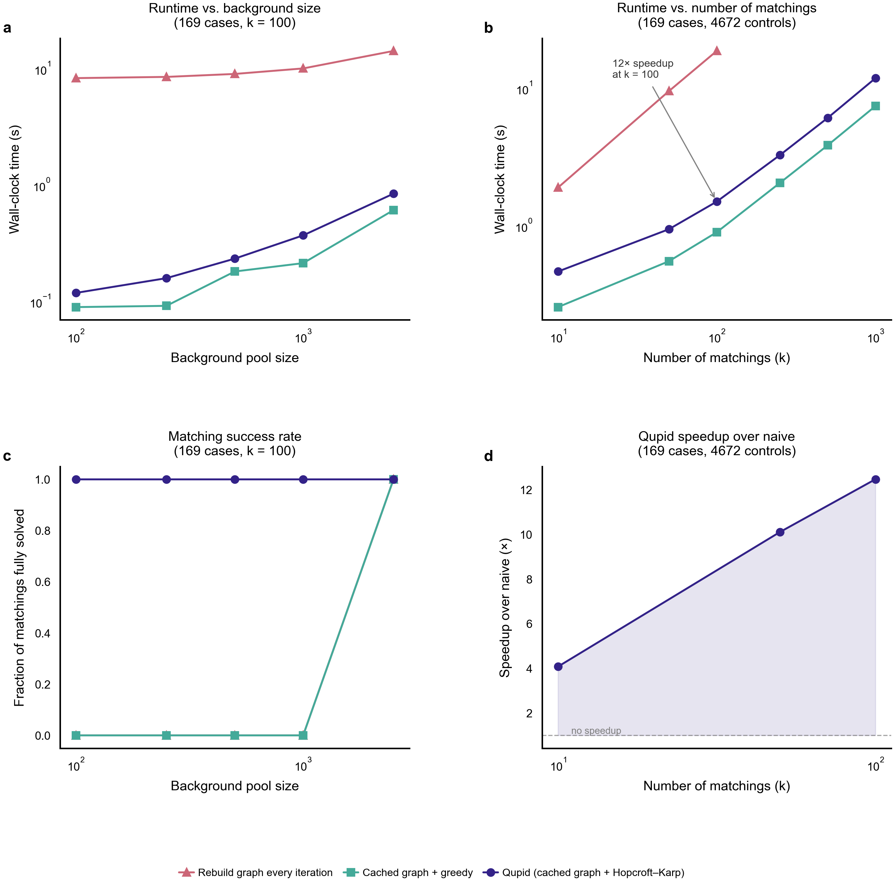
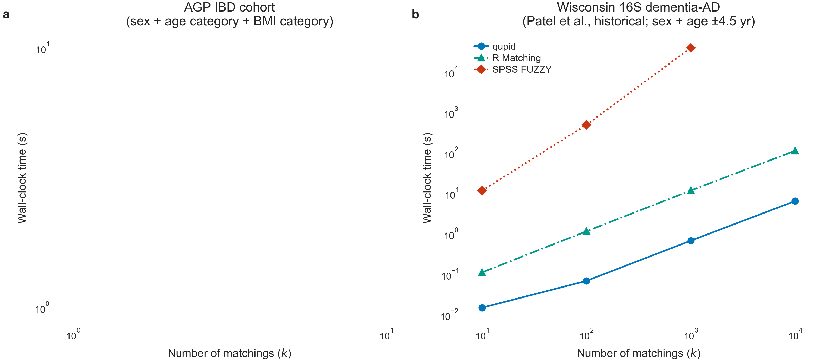
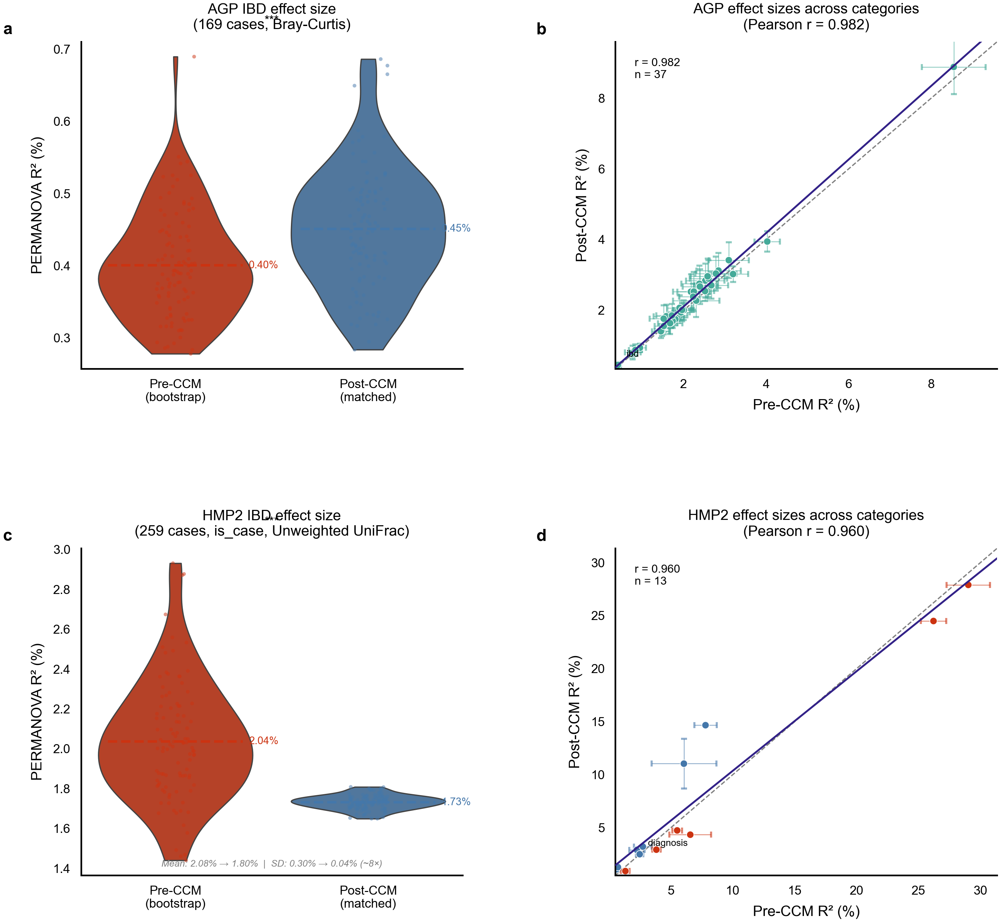
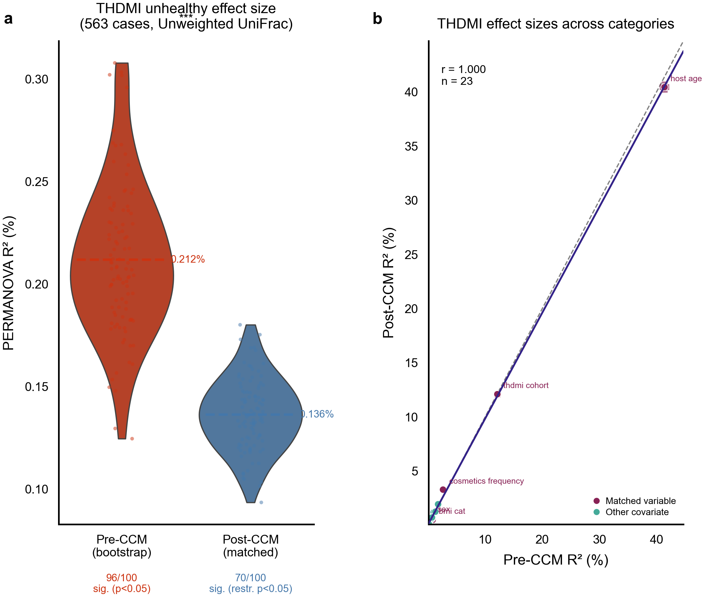

# Qupid: A Framework for Multiple Case-Control Matching in Microbiome Studies

Leo Joseph1,4, Lucas Patel1,5,6, Gibraan Rahman1,2, Rob Knight1,2,3,4*

1Department of Pediatrics, University of California San Diego, La Jolla, CA, USA
2Center for Microbiome Innovation, University of California San Diego, La Jolla, CA, USA
3Department of Computer Science and Engineering, University of California San Diego, La Jolla, CA, USA
4Department of Bioengineering, University of California San Diego, La Jolla, CA, USA
5Medical Scientist Training Program, University of California San Diego, La Jolla, CA, USA
6Bioinformatics and Systems Biology Program, University of California San Diego, La Jolla, CA, USA

*Correspondence: robknight@ucsd.edu

## Abstract

Case-control matching (CCM) is a standard tool for reducing confounding in microbiome studies, but matching is inherently stochastic, and a single matching may not represent an optimal or reproducible study design. We present Qupid, a Python package and QIIME 2 plugin that generates and statistically evaluates multiple case-control matchings to characterize the distribution of possible designs and identify those that maximize separation between groups. Qupid amortizes the cost of multi-matching by constructing the case-to-valid-control bipartite graph once and then applying a randomized maximum-cardinality matching algorithm across iterations, enabling 100 matchings on cohorts of thousands of samples in seconds and outperforming the most widely used external matching tools (MatchIt, R Matching, CEM) by 2.9–4.1× at k = 100 (3.8× vs. MatchIt, the most widely used) on a shared AGP IBD benchmark. Applied to three cohorts using PERMANOVA effect sizes, Qupid recovers three distinct regimes of CCM behavior: in the American Gut Project (AGP) IBD cohort, mean R2 increased modestly from 0.40% to 0.43% after CCM (relative increase of 8%, two-sample t-test across 100 iterations, p = 0.006), consistent with the large imbalanced control pool attenuating the measured disease signal; in the Human Microbiome Project 2 (HMP2) IBD cohort — within the demographically matched, Crohn's-enriched 259-case subset of 1,179 IBD cases — mean R2 for the binary IBD comparison (is_case) was 2.08% pre-CCM and 1.80% post-CCM while the standard deviation collapsed ~8-fold (0.30% to 0.04%), and a negative-control analysis attributed ~61% of this stabilization to demographic matching itself and ~39% to mechanical control-pool overlap; in the THDMI cohort, the composite "unhealthy" effect dropped from 0.206% to 0.134% (−35%) after matching on demographic covariates (pre-CCM: 97/100 iterations significant by standard PERMANOVA p < 0.05; post-CCM: 67/100 by pair-aware restricted-permutation p < 0.05), indicating that the apparent association is substantially, though not entirely, attributable to demographic confounders. By generating distributions of effect sizes rather than relying on a single arbitrary matching, Qupid lets researchers distinguish biological signal from artifacts of study design.

## Main

Microbiome case-control studies are commonly affected by confounding variables that can inflate or mask true biological effects [1,2]. Confounding is hard to remove in microbiome data for several reasons: extreme sample size imbalances are common (for example, 27:1 control-to-case ratios in citizen-science cohorts such as AGP); multiple categorical and continuous covariates must be balanced simultaneously; and downstream beta-diversity inference is sensitive to both group size and the specific realization of matching, with PERMANOVA R2 in particular known to vary with group size and dispersion structure [3,4].

A wide range of matching and adjustment approaches have been developed to address confounding in observational data. Propensity score methods, optimal matching, and genetic matching are well established in epidemiology and have mature implementations in R, including MatchIt, optmatch, and cobalt [5–7]. Matching in microbiome studies has been discussed in the context of improving compositional comparisons [19]. Microbiome-specific tools have addressed confounding through covariate adjustment within linear models (MaAsLin2/3 [8,9], ANCOM-BC2 [10]) or through batch correction (MMUPHin [11], ConQuR [12]). The recently developed miMatch tool [20] matches samples via propensity scores on inferred microbial metabolic background (principal components of metabolic pathway profiles), producing a single matched cohort — an indirect, microbiome-intrinsic approach distinct from direct host-covariate matching. These approaches typically return a single, deterministic matched set or a single adjusted estimate. Because the choice of which control to assign to each case is itself stochastic when multiple valid controls exist, a single matching can over- or underestimate the true effect, and current tools do not let researchers characterize the distribution of effect sizes that are compatible with a given set of matching constraints.

We developed Qupid to fill this gap. Qupid (1) identifies all valid controls for each case based on user-specified discrete and tolerance-based numeric criteria, (2) generates many one-to-one matchings from this valid-control graph using a randomized maximum-cardinality bipartite matching algorithm, and (3) statistically evaluates which matchings maximize separation between cases and controls using univariate or multivariate (PERMANOVA) tests. Qupid is implemented as a standalone Python package (`pip install qupid`) and as a QIIME 2 plugin, enabling integration with existing microbiome workflows [13].

## Results

### Qupid scales to large background pools through bipartite graph optimization

A naive approach to multi-matching repeats the entire valid-control identification step for every iteration, scaling as O(k · ncases · ncontrols) for k iterations. Qupid amortizes this by constructing the case-to-valid-control bipartite graph once, using vectorized pandas and NumPy operations to evaluate exact matches on discrete categories and tolerance-based comparisons on numeric covariates. The resulting `CaseMatchOneToMany` object is then re-sampled k times via a modified Hopcroft–Karp maximum-cardinality bipartite matching algorithm [14], in which neighbor selection during depth-first search is randomized so that successive iterations recover diverse valid matchings rather than the deterministic output of the standard algorithm. Hopcroft–Karp runs in O(E·√V) per iteration on the precomputed graph.

We benchmarked Qupid against two baselines on the AGP IBD configuration (169 cases, up to 4,672 controls, three matching covariates). The first baseline rebuilds the valid-control graph from scratch every iteration; the second caches the graph once and then assigns controls greedily by sampling without replacement. Neither baseline solves the maximum-cardinality bipartite matching problem, and this correctness gap is consequential: at small background sizes (ncontrols ∈ {100, 250, 500, 1,000}), where the valid-control graph is tight, both greedy baselines failed to match all 169 cases in any of 100 iterations, while Qupid's Hopcroft–Karp algorithm succeeded in all 100 iterations at every background size tested (Fig. 1a, c). Only at ncontrols = 2,500, where the average number of valid controls per case substantially exceeded ncases, did greedy assignment begin to succeed. Hopcroft–Karp's guaranteed maximum cardinality is therefore not an academic property: it determines whether multi-matching is feasible at all under realistic matching constraints. A fast but incorrect tool is not useful for the matched-distribution workflow Qupid is designed to support.

Given correctness, Qupid is also fast: at the full AGP background (k = 100), Qupid completed all 100 matchings in 1.5 seconds versus 18.6 seconds for the rebuild-every-iteration baseline, a 12.5-fold speedup driven entirely by amortizing the O(ncases · ncontrols) graph-construction cost across iterations (Fig. 1b, d). The speedup grew from 4.1× at k = 10 to 12.5× at k = 100, reflecting the fixed graph-construction cost being divided across more iterations. The cached-graph greedy baseline ran faster than Qupid in absolute terms (0.9 s vs. 1.5 s at k = 100) when it produced a matching at all, since random-greedy assignment is O(ncases) per iteration while Hopcroft–Karp is O(E·√V); but this speed advantage came at the cost of the 0/100 success rate documented above at tight-graph regimes.

Runtime also scaled favorably with constraint tightness. Going from one covariate (sex only) to three covariates (sex + age category + BMI category) reduced Qupid's wall-clock time from 18.4 s to 1.5 s at k = 100, an order-of-magnitude speedup because a sparser bipartite graph requires fewer augmenting paths. The rebuild-every-iteration baseline showed no such improvement (15.7 s → 18.7 s) because it pays the graph-construction cost on every iteration regardless of graph density.

**Figure 1. Qupid runtime characteristics (AGP IBD dataset, 169 cases).** (a) Runtime vs. background pool size (k = 100 matchings, 3 covariates): Qupid (blue) completes in < 1 s at all pool sizes and achieves 100/100 successful matchings; both greedy baselines fail entirely at ncontrols ≤ 1,000. (b) Runtime vs. number of matchings k (4,672 controls): Qupid achieves a 12.5× speedup over the naive rebuild-every-iteration baseline at k = 100. (c) Fraction of iterations fully matched vs. background pool size, showing Hopcroft–Karp's correctness advantage over greedy assignment in the tight-graph regime. (d) Speedup factor of Qupid over the naive baseline as a function of k.

### Qupid outperforms widely used host-covariate matching tools at multi-matching scale

To position Qupid relative to current host-covariate matching software, we benchmarked it head-to-head against three of the most widely used external matching tools — MatchIt [6], R `Matching` (Sekhon `Match` package [23]), and CEM (Coarsened Exact Matching [24]) — on the AGP IBD cohort under the same matching constraints used elsewhere in this study (sex + age category + BMI category; 159 cases, 4,400 controls after dropping AGP missingness sentinels; Fig. 2). Each external tool was invoked under its standard one-to-one matching configuration (MatchIt: `method = "nearest"` with exact strata on all three covariates; R `Matching`: `Match` with `M = 1` and `exact = TRUE`; CEM: default categorical-binning behaviour) and looped k times to mimic a multi-matching workflow, because none of these tools provides a native multi-matching abstraction. We verified empirically that all three external tools are deterministic under their default configurations: looping the same call without re-seeding returned byte-identical matched sets on every iteration. An important asymmetry underlies this: MatchIt and R `Matching` are deterministic in their standard single-matching configuration but *could* be re-seeded to yield distinct matchings (at the same per-call cost), whereas CEM is *fundamentally order-invariant* — a single weighted stratification of all 4,344 units that yields one coarsened-exact matched set and cannot produce k distinct matchings even with reshuffling. Its k-curve is therefore shown to illustrate the cost of repeated invocation rather than a recommended workflow, analogous to the rebuild-every-iteration baseline in Fig. 1.

Qupid's wall-clock time grew sub-linearly with k (0.36 s at k = 1 to 1.22 s at k = 100) because the bipartite graph is built once and re-sampled, while the three external tools all scaled approximately linearly because each call re-evaluates valid controls from scratch. At k = 1, R `Matching` (≈ 0.05 s) and CEM (≈ 0.06 s) had a lower fixed cost than Qupid, but their per-iteration cost dominated by k ≈ 3–12; at k = 100, Qupid completed all 100 matchings 2.9× faster than R `Matching` (3.48 s), 3.8× faster than MatchIt (4.59 s), and 4.1× faster than CEM (4.94 s), with the gap widening at larger k. For single-matching workflows the established tools remain marginally faster than Qupid; Qupid's advantage is specific to the multi-matching regime (k ≳ 10), which is the use case it is designed for. The microbiome-specific matching tool miMatch [20] was not included in this comparison because it matches on principal components of inferred microbial metabolic background rather than host covariates, returns a single matched cohort with no iteration axis, and is distributed as a config-file command-line tool rather than an importable matching API; a head-to-head wall-clock comparison would be uninformative.

**Figure 2. Qupid amortizes multi-matching where established tools do not.** Wall-clock time (log–log axes) vs. number of matched sets k on the AGP IBD cohort (159 cases, 4,400 controls; sex + age category + BMI category, categorical matching), for Qupid (blue) and three widely used host-covariate matching tools: MatchIt (orange; `method="nearest"` with exact strata), R `Matching` (teal; `Match` 1:1 exact), and CEM (red; coarsened exact matching). Points are median of three runs. Qupid builds the case-to-valid-control bipartite graph once and re-randomizes the matching per iteration, so its runtime is near-flat in k (0.36 s at k = 1 to 1.22 s at k = 100). The three external tools have no native multi-matching capability; producing k matched sets requires k independent invocations, so each scales linearly in k and crosses above Qupid by k ≈ 3–12. At k = 100, Qupid is 2.9× faster than R `Matching` (3.48 s), 3.8× faster than MatchIt (4.59 s), and 4.1× faster than CEM (4.94 s). MatchIt and R `Matching` are deterministic under their default configurations but could in principle be re-seeded to yield distinct matchings at the same per-call cost; CEM is fundamentally order-invariant (a single weighted stratification that cannot produce k distinct matchings even with reshuffling) and its curve is shown to illustrate the cost of naive repeated invocation.

### Case-control matching (CCM) modestly increases the AGP IBD disease signal

We first evaluated Qupid on the American Gut Project (AGP) cohort, which contains 169 IBD cases diagnosed by a medical professional and 4,672 controls (1:27.6 imbalance ratio). Cases were matched to controls on sex, age category, and BMI category (all discrete) using Bray-Curtis distances. To enable fair comparison of effect sizes before and after CCM, we controlled for sample size by bootstrap-subsampling the pre-CCM data to the post-CCM size (n = 169 cases + 169 controls = 338 samples per iteration, 100 iterations), since PERMANOVA R2 is sensitive to group-size imbalance. All 169 cases had complete metadata for the three matching covariates and were successfully matched in at least one of the 100 iterations (0 excluded; AGP_matched_vs_excluded.csv), so the post-CCM cohort represents the full case set with no case-selection bias introduced by matching.

Qupid matching produced significantly larger effect sizes for the IBD case-control comparison (Fig. 3a). Mean PERMANOVA R2 increased from 0.40 ± 0.07% (pre-CCM bootstrap) to 0.43 ± 0.09% (post-CCM), an 8% relative increase (p = 0.006, t-test). While these absolute effect sizes are modest, as is typical for microbiome studies in which any single covariate explains a small fraction of compositional variance, the consistent relative increase is consistent with heterogeneity in the large control pool attenuating the measured disease signal. Pre- and post-CCM effect sizes were highly correlated across all metadata categories (Pearson r = 0.995, p < 10−10; Fig. 3b), with the linear fit lying systematically above the identity line, confirming that matching increased effect sizes across covariates rather than only the case-control axis.

### CCM stabilizes effect size estimates in the HMP2 IBD cohort

We next applied Qupid to the Human Microbiome Project 2 (HMP2) cohort. HMP2 contained 1,179 IBD cases (Crohn's disease and ulcerative colitis combined) and 413 non-IBD controls (2.9:1 ratio). Cases were matched on sex, race, and site, plus consent age within ±5 years, using unweighted UniFrac distances computed against the Greengenes2 2024.09 reference phylogeny. Although HMP2 contained 1,179 cases in total, the matching constraints and the smaller control pool yielded 259 cases with valid matches per iteration, giving a balanced 259 + 259 = 518-sample dataset. To assess whether this matched subset is representative of the full case pool, we identified all cases appearing in at least one of the 100 matched iterations (268 unique cases across iterations, approximately 259 per iteration) and compared their clinical and demographic characteristics to the 911 excluded cases (Supplementary Table 2). The ever-matched cases were significantly enriched for Crohn's disease (77% CD vs. 58% among excluded; χ² p < 0.001) and substantially younger (median consent age 16 vs. 25 years; Mann–Whitney p < 0.001), with a higher proportion female (60% vs. 50%; χ² p = 0.007). These differences reflect the demographic structure of the matching constraints: cases whose sex, race, site, and age align with the available control pool are preferentially retained. The stabilization result reported below — including the 8-fold SD collapse in the is_case comparison — therefore characterizes the IBD–microbiome relationship within this demographically constrained, CD-enriched subset rather than the full 1,179-case IBD pool.

In contrast to AGP, the binary IBD case-control comparison (is_case: IBD vs. nonIBD) showed a modest mean shift after matching (Fig. 3c): mean R2 was 2.08 ± 0.30% pre-CCM and 1.80 ± 0.04% post-CCM (−13.5%, two-sample t-test: t = 9.43, p < 10−15). The key benefit of CCM in HMP2 was a ~8-fold reduction in the standard deviation across iterations (0.30% to 0.04%), corresponding to a ~60-fold reduction in variance. This dramatic variance reduction reflects the fact that post-CCM matchings are drawn from a constrained, balanced pool, whereas the pre-CCM bootstrap samples from the full imbalanced cohort; the disease effect is far more precisely estimated after matching. Part of this collapse is attributable to the small control pool: with 259 controls drawn from 413 per iteration, matched subsets share approximately 63% of controls across iterations on average. To quantify this mechanical contribution, we conducted a negative-control analysis fixing a constant set of 259 cases while randomly drawing 259 unmatched controls from the 413-control pool across 100 iterations — isolating the control-pool overlap effect without any demographic matching. This negative control yielded SD = 0.14%, situating the mechanical floor between the pre-CCM bootstrap (0.30%) and the post-CCM matched value (0.04%). Of the total 0.26% SD reduction, approximately 39% arises from control-pool overlap alone, while 61% is attributable to demographic matching itself, confirming that the majority of the variance reduction reflects a genuine precision gain from matched study design rather than a pool-size artefact. This decomposition assumes the mechanical (control-pool overlap) and demographic-matching contributions are additive; if matching induces greater control reuse than random draws, the 39% mechanical fraction should be interpreted as a lower bound. The three-way diagnosis effect (UC vs. CD vs. nonIBD) across all metadata categories is shown in Fig. 3d (mean R2: 2.53% → 2.55%). These results demonstrate that multi-matching characterizes the reproducibility of effect size estimates, a benefit that would be invisible with a single arbitrary matching.

Across covariates, 7 of 13 tested categories showed increased effect sizes after matching (Fig. 3d, Pearson r = 0.960, p < 10−7). The largest increases were in disease-related clinical covariates: baseline Montreal disease location (+94%), antibiotics (+84%), sex (+81%), bowel movement frequency (+77%), and abdominal pain (+34%). The linear fit lay above the identity line for categories with R2 < 20% (the majority of the data), while the two largest-valued categories — age at diagnosis and consent age, both of which were matching covariates — fell below the identity line, reflecting the expected reduction in these demographic confounders after matching. Blood in stool (−36%), probiotic use (−33%), and site (−24%) also decreased, with site and consent age decreasing as expected given that they were matched upon.

### CCM exposes confounding in the THDMI composite "unhealthy" phenotype

To test whether CCM universally increases effect sizes, we analyzed the THDMI (The Human Diets and Microbiome Initiative) cohort, a multi-country study with nearly balanced groups (1,058 unhealthy vs. 918 healthy individuals, 1.15:1). The binary "unhealthy" label was constructed following the methodology of Khatib et al. [17], aggregating individuals reporting at least one of: diabetes, cardiovascular disease, IBS, obesity, mental illness, cancer, autoimmune conditions, thyroid disorders, or lung disease. The THDMI study itself identified country (thdmi_cohort), BMI, cosmetics use, and age as the primary drivers of microbiome variation in this cohort (PERMANOVA P < 0.001 for country [17]), and adjusted all unhealthy-microbiome associations for thdmi_cohort in its own regression analyses — implicitly acknowledging the confounding potential of these variables. Cases were matched on sex, THDMI cohort (country), BMI category, and cosmetics use frequency, plus host age within ±5 years, using Unweighted UniFrac distances computed against the Greengenes2 2024.09 genome-level phylogeny.

In contrast to AGP and HMP2, the THDMI unhealthy effect size *decreased* after matching (Fig. 4a): R2 dropped from 0.206 ± 0.038% (pre-CCM bootstrap) to 0.134 ± 0.014% (post-CCM), a 35% relative decrease. The fraction of iterations achieving significance fell from 97 of 100 (pre-CCM, standard PERMANOVA p < 0.05) to 67 of 100 (post-CCM, pair-aware restricted-permutation p < 0.05). The continued significance in a majority of post-CCM iterations indicates a residual association beyond demographic confounding; the 35% reduction in mean R2 and the across-covariate scatter (Fig. 4b) — where the largest effect-size decreases fall precisely on the variables matched upon (BMI category, sex, THDMI cohort, and host age) — demonstrate that those demographic variables contribute substantially to the apparent effect. Together, these results indicate that the unhealthy-microbiome association in THDMI is substantially, though not entirely, attributable to demographic covariates. Strikingly, Qupid independently reproduced the same confounding structure that the original THDMI study handled through regression adjustment [17]: by balancing cases and controls on the exact demographic variables that dominate between-sample microbiome variation in that cohort, Qupid reveals the demographic contribution without requiring any model specification or covariate selection beyond the matching criteria.

## Discussion

We developed Qupid to make multi-matching evaluation a routine part of microbiome case-control study design. Two design decisions drive Qupid's utility. First, matching is not deterministic when multiple valid controls exist for each case, so reporting a single arbitrary matching can hide the variability of downstream inference; Qupid replaces this single point estimate with an empirical distribution over matchings. Second, by separating valid-control identification (graph construction) from one-to-one assignment (randomized Hopcroft–Karp), Qupid makes it cheap to scale that distribution to hundreds or thousands of matchings.

Across three cohorts, Qupid revealed three distinct regimes of CCM behavior. In the AGP IBD cohort, where 169 cases were drawn from a pool of 4,672 controls, CCM yielded a modest but statistically significant increase in the disease signal (8% relative, p = 0.006): matching on demographic covariates removed heterogeneity from the control pool and revealed a more consistent effect of IBD on microbiome composition. In the HMP2 IBD cohort, where the matching constraints were tighter and the matched cohort (259 pairs) is a Crohn's-enriched (77% CD vs. 58% in excluded), demographically constrained subset of the full 1,179 cases (Supplementary Table 2), CCM *stabilized* estimates within that subset: the mean binary IBD effect shifted modestly, but the variance across iterations collapsed ~60-fold (≈8-fold in standard deviation), providing a far more reproducible characterization of the IBD microbiome signal within the matched subpopulation than any single matching could offer. In the THDMI cohort, CCM *partially exposed confounding*: the apparent unhealthy-microbiome association was attenuated after matching on the demographic variables correlated with the composite "unhealthy" label (97/100 → 67/100 iterations significant; R2 reduced by 35%), while continued significance in a majority of matched iterations suggests a residual biological component not fully explained by demographics.

These three regimes — amplification, stabilization, and confounding exposure — are not in tension. They represent different relationships between the phenotype of interest and the matching variables. When matching variables are independent confounders of a well-defined phenotype (AGP), CCM sharpens the signal. When the matched cohort is a selected subset of a larger case pool and the phenotype is real but the full cohort is heterogeneous (HMP2), CCM's primary benefit is precision rather than power *within that subset*; the matched-cohort selection bias (here, Crohn's enrichment) must be flagged in any downstream interpretation. When the phenotype correlates with the matching variables (THDMI), CCM attenuates the confounded portion of the association, revealing both the demographic contribution and a residual phenotypic signal — here, 67 of 100 post-CCM iterations remained significant, indicating a biological component that persists after demographic adjustment. In all three cases, the distribution of effect sizes across matchings provides interpretive information that a single arbitrary matching cannot.

These regime distinctions were made tractable in practice by a runtime infrastructure designed for multi-matching at production scale: Qupid amortizes the case-to-valid-control bipartite graph across iterations and outperforms three widely used host-covariate matching tools (MatchIt, R `Matching`, CEM) by 2.9–4.1× at k = 100 on a shared AGP benchmark (Fig. 2), and a vectorized PERMANOVA implementation included with the package reduces per-iteration significance-test cost by ~6–10× over the scikit-bio reference implementation while preserving pseudo-F values to within floating-point precision (Supplementary Fig. 2). Together these implementation choices make the 100-iteration multi-matching workflow tractable on a laptop for cohorts of thousands of samples.

Several caveats apply. First, Qupid does not recover cases that have no valid controls under the user-specified constraints; in HMP2, 920 of 1,179 IBD cases were dropped because no control satisfied the (sex, race, site, age ± 5) criteria simultaneously. Tighter constraints yield cleaner comparisons but smaller matched cohorts, and the appropriate trade-off is study-specific. Second, the effect-size distribution Qupid generates is conditioned on the user's choice of matching variables; including a strong confounder is sometimes the goal (as in IBD) and sometimes obscures the phenotype of interest (as in THDMI), and Qupid does not distinguish these cases automatically. Third, although Qupid evaluates matching quality through PERMANOVA effect-size distributions, it is not itself a differential abundance method, and it does not adjust for residual within-stratum variation the way regression-based covariate adjustment does. Fourth, composite phenotype labels — such as the THDMI "unhealthy" designation, which aggregates nine heterogeneous conditions (diabetes, cardiovascular disease, IBS, cancer, and others) — may dilute effect sizes relative to studies targeting a single well-defined condition, and the resulting attenuation and confounding structure may not generalize to individual diagnoses within the composite. We view multi-matching evaluation and covariate adjustment as complementary rather than competing: Qupid is most useful upstream of, or alongside, methods that perform inference on the matched cohort.

In summary, Qupid provides a systematic, computationally efficient framework for generating and evaluating multiple case-control matchings in microbiome studies. By replacing the single arbitrary matching that has been standard practice with a distribution over valid matchings, Qupid lets researchers characterize the variability of downstream effect sizes, identify designs that best separate cases from controls, and recognize when an apparent disease signal is in fact an artifact of demographic confounding. Qupid is freely available at https://github.com/gibsramen/qupid under a BSD-3-Clause license, with a QIIME 2 plugin for integration into existing microbiome workflows.

## Methods

### Datasets

The American Gut Project (AGP) dataset [15] was obtained from Qiita study 10317. We selected fecal samples with complete metadata for IBD diagnosis, retaining 169 cases (diagnosed by a medical professional) and 4,672 controls reporting no IBD diagnosis (1:27.6 case-control ratio).

The Human Microbiome Project 2 (HMP2/IBDMDB) dataset [16] was obtained from the IBDMDB portal (https://ibdmdb.org), with 1,179 IBD cases (Crohn's disease and ulcerative colitis combined) and 413 non-IBD controls (2.9:1 ratio).

The THDMI (The Human Diets and Microbiome Initiative) dataset [17] contained samples from five countries. A binary healthy/unhealthy variable was derived following the methodology of Khatib et al. [17], labeling as "unhealthy" any individual reporting at least one of: diabetes, cardiovascular disease, IBS, obesity, mental illness, cancer, autoimmune conditions, thyroid disorders, or lung disease, yielding 1,058 unhealthy and 918 healthy individuals (1.15:1 ratio).

AGP and HMP2 were processed through QIIME 2 [13] using standard whole-genome shotgun sequencing workflows with Greengenes2 2024.09 as the reference database. THDMI was processed using whole-genome shotgun sequencing through the Greengenes2 2024.09 genome-level database (GG2 micov pipeline), producing feature tables keyed by GG2 genome identifiers.

### Case-control matching with Qupid

Case-control matching was performed using Qupid v0.1.0 with a fixed random seed (seed = 42) to ensure reproducibility. Matching criteria for each cohort were as follows. **AGP**: discrete matching on sex, age category, and BMI category. **HMP2**: discrete matching on sex, race, and collection site, plus numeric matching on consent age with ±5 year tolerance. **THDMI**: discrete matching on sex, THDMI cohort (country), BMI category, and cosmetics use frequency, plus numeric matching on host age with ±5 year tolerance.

Qupid first identifies all valid controls for each case using the `match_by_multiple` function, producing a `CaseMatchOneToMany` object that encodes a bipartite graph between cases and their valid controls. The `create_matched_pairs` method then generates k = 100 one-to-one matchings from this graph using a modified Hopcroft–Karp maximum-cardinality bipartite matching algorithm [14], in which neighbor order during depth-first search is randomized so that each iteration produces a different valid maximum matching. This procedure recovers diverse valid maximum matchings but does not uniformly sample the space of all possible maximum matchings. To characterize the consequences of this non-uniformity, we ran Qupid's `create_matched_pairs` N = 100,000 times on a small test bipartite graph (5 cases × 8 controls; M = 165 distinct maximum matchings, enumerated exhaustively) and compared the empirical per-matching frequencies to the uniform expectation (Supplementary Fig. 3). Qupid reached every one of the 165 matchings, confirming full coverage of the matching space; the per-matching probabilities differed from uniform (total-variation distance 0.189, KL divergence 0.113), but the marginal distribution of PERMANOVA pseudo-F on a synthetic distance matrix was well-preserved (mean pseudo-F: 1.83 under uniform vs. 1.70 under Qupid sampling, a 7.1% relative shift; standard deviations 1.64 vs. 1.61). The effect-size distributions reported throughout this paper should therefore be interpreted as the distribution under Qupid's randomized maximum-cardinality sampler rather than the uniform distribution over the matching space, but the small downstream pseudo-F shift suggests this distinction is not consequential at the level of regime-classification claims. We note that this bound is demonstrated at small graph scale; whether the 7.1% pseudo-F shift extrapolates to graphs that are orders of magnitude larger (the production cohorts in this study range from 159 × 4,400 to 1,058 × 918) is not directly characterized but is consistent with the expectation that randomized Hopcroft–Karp explores larger graphs more diffusely as |E|·√V grows.

Beyond the sampling distribution, k should be chosen large enough for distribution statistics to stabilise, as validated empirically by the convergence results in Supplementary Fig. 1. Each iteration yielded a balanced cohort: AGP, 169 + 169 = 338 samples; HMP2, 259 + 259 = 518 samples; THDMI, 563 + 563 = 1,126 samples. The choice of k = 100 was validated empirically: running mean R² and its standard deviation stabilise by k ≈ 30–40 for all three cohorts (Supplementary Fig. 1), providing ample buffer for robust inference at k = 100.

### Sample-size control via bootstrap subsampling

PERMANOVA R2 is sensitive to group-size imbalance, so direct comparison between pre-CCM (imbalanced) and post-CCM (balanced) effect sizes is not valid. To enable fair comparison, we bootstrap-subsampled the pre-CCM data to match post-CCM sample sizes for each cohort: AGP, 169 cases + 169 randomly drawn controls; HMP2, 259 cases + 259 controls; THDMI, 563 cases + 563 controls. Controls were drawn randomly from the full background pool without any demographic matching. Subsampling was stratified by case status to maintain the target ratio, and the procedure was repeated for 100 iterations to generate a pre-CCM effect-size distribution comparable to the 100 post-CCM iterations. Thus the pre-CCM bootstrap arm is a size-matched but *demographically unmatched* comparison; differences between the pre- and post-CCM distributions reflect the effect of demographic matching, not sample size alone.

When the number of available controls is smaller than the number of cases, Qupid's `create_matched_pairs` method returns partial matchings (i.e., fewer than n_cases pairs) unless `strict=True` is specified. The cohort sample sizes reported above reflect the mean number of successfully matched pairs per iteration; in the HMP2 cohort, the 259-pair count reflects the constraint that 920 of 1,179 cases had no valid control satisfying all matching criteria simultaneously. Similarly, the THDMI 563-pair count reflects the constraint that 495 of 1,058 unhealthy cases and 355 of 918 healthy controls had no valid match under the (sex, THDMI cohort, BMI category, cosmetics use, host age ± 5) criteria simultaneously.

### Beta diversity and effect size estimation

Beta diversity distances were computed using scikit-bio. For AGP, Bray-Curtis dissimilarities were computed from the rarefied feature table (unweighted UniFrac was not used for AGP because the AGP feature table was keyed by sequence variants rather than Greengenes2 genome identifiers, precluding phylogenetic distance computation against the GG2 tree). For HMP2 and THDMI, unweighted UniFrac distances were computed against the Greengenes2 2024.09 reference phylogeny using scikit-bio's beta_diversity function. PERMANOVA was run with 999 permutations using a vectorized implementation distributed with Qupid (`qupid.stats._fast_permanova`) that computes pseudo-F across all permutations as two batched matrix multiplications via the centered Gram matrix G = −½H·D²·H (where H = I − 11′/n), rather than scikit-bio's reference per-permutation Python loop. The vectorized implementation produces pseudo-F values identical to scikit-bio's reference implementation to within double-precision floating-point round-off: absolute differences of 4.72 × 10−14 at n = 500 and 6.06 × 10−13 at n = 1,126 (the largest matched cohort in this study, THDMI) on real Bray-Curtis matrices subsampled from the THDMI feature table, and 2.81 × 10−13 at n = 500 on a real unweighted UniFrac matrix from the same cohort against the Greengenes2 phylogeny. The mild scaling of round-off with cohort size reflects the expected accumulation across ~n³ matrix-multiplication operations and remains well within machine precision (relative difference 9.1 × 10−13 at n = 1,126, i.e. 12 significant digits of agreement). The vectorized implementation is also ~6–10× faster at 999 permutations for cohort sizes spanning n = 20–500 samples per matching (Supplementary Fig. 2). All real-data PERMANOVA results reported in this paper (AGP Bray-Curtis, HMP2 and THDMI unweighted UniFrac) were computed with this vectorized implementation; Supplementary Fig. 2 isolates the per-call speedup on synthetic random distance matrices to control for cohort-specific variation in matrix structure. R2 (proportion of variance explained) was derived from the pseudo-F statistic as R2 = (F · dfbetween) / (F · dfbetween + dfwithin), where dfbetween = ngroups − 1 and dfwithin = nsamples − ngroups. Effect sizes were computed for the primary case-control comparison and for all metadata categories with at least two groups containing ≥10 samples each. R2 values are reported as percentages. Note that PERMANOVA R2 carries a positive bias that increases with group-size imbalance [21]; because both pre- and post-CCM comparisons share this bias, the relative change across conditions is the interpretable quantity rather than the absolute values.

### Statistical comparisons

Differences between pre-CCM (bootstrap) and post-CCM effect-size distributions were assessed using independent-samples t-tests. Correlations between pre- and post-CCM effect sizes across metadata categories were computed using Pearson correlation. Effect-size changes were considered significant at α = 0.05.

For the primary case-control comparison (is_case), significance in the matched (post-CCM) arm was assessed using within-pair restricted permutations, which respect the 1:1 matching structure [22]. Within each CCM iteration, case and control labels were permuted *within* matched pairs (i.e., each pair independently swaps labels with 50% probability), preserving the paired design; pseudo-F was recomputed for each of 999 permutations, and the p-value was calculated as (n_exceed + 1) / (999 + 1). The pre-CCM bootstrap arm has no pair structure (controls are drawn randomly, not matched) and therefore uses the standard unrestricted PERMANOVA p-value. This asymmetry is by design: the two arms use the permutation scheme appropriate to each, rather than forcing an identical but incorrect test on the matched arm. The restricted within-pair approach is a design-based analogue of the projection-constrained within-set PERMANOVA described by Zhu et al. [22] for matched microbiome data; our implementation swaps case/control labels within each pair rather than projecting onto the within-set contrast space, which is equivalent for balanced 1:1 binary case-control designs.

Multiple comparisons across metadata categories were controlled using the Benjamini–Hochberg false discovery rate (FDR) procedure [18], applied within each CCM iteration across all categories tested. Q-values (FDR-adjusted p-values) are exported alongside raw p-values. For the THDMI post-CCM arm, the headline significance count uses the within-pair restricted-permutation p-value (see above); for the THDMI pre-CCM bootstrap arm, the standard unrestricted PERMANOVA p-value is used. Both are compared at α = 0.05. Note that for the primary is_case comparison, FDR q-values typically equal the raw p-value because is_case tends to be the strongest signal per iteration and FDR correction acts on all tested categories simultaneously. FDR q-values are the primary significance criterion for all other (non-is_case) across-category comparisons. A supplementary table of HMP2 per-category R2 changes is provided in Supplementary Table 1.

### Runtime benchmarks

Internal scaling experiments (Fig. 1) were conducted on the AGP IBD configuration (169 cases) by varying one of three parameters at a time: background pool size (ncontrols ∈ {100, 250, 500, 1,000, 2,500, 4,672} at fixed k = 100 and three covariates), number of matchings (k ∈ {10, 25, 50, 100, 250, 500, 1,000} at fixed ncontrols = 4,672 and three covariates), and number of matching covariates (one to three categorical covariates at fixed k = 100). Three matching strategies were compared at each configuration: Qupid (cached bipartite graph + randomized Hopcroft–Karp), a cached-graph greedy assignment baseline, and a naive baseline that rebuilds the valid-control graph every iteration. Wall-clock time was recorded as the median of three independent runs using Python's high-resolution monotonic timer (`time.perf_counter`).

For the external-tool comparison (Fig. 2), Qupid was benchmarked head-to-head against three widely used host-covariate matching packages on the same AGP cohort under categorical matching only (sex + age category + BMI category), because numeric age is redacted in the public AGP metadata. The external-tool benchmark cohort is slightly smaller than the analysis cohort (159 vs. 169 cases; 4,400 vs. 4,672 controls) because AGP missingness sentinels ("not provided", "not collected") were dropped from the categorical matching covariates prior to benchmarking; the same drop has no effect on the internal-scaling experiments in Fig. 1, which use the analysis-cohort sample sizes throughout. The three external tools were: (i) **MatchIt** (R, version 4.5.x; `method = "nearest"`, `exact = ~ sex + age_cat + bmi_cat`, `ratio = 1`, `replace = FALSE`, with MatchIt's default within-stratum propensity for nearest-neighbour ordering); (ii) **R `Matching`** (Sekhon `Matching` package; `Match(Y, Tr, X, M = 1, exact = TRUE)`, replicating the categorical-exact configuration used by Patel et al. in their `perform_matching.R` script); and (iii) **CEM** (Coarsened Exact Matching; Iacus, King & Porro `cem` package, called in a dedicated `r-cem` conda environment because the CRAN `cem` package only builds for R ≤ 4.3 while the other tools run on R 4.5). Each tool was invoked under its standard one-to-one matching configuration and looped k times because none provides a native multi-matching abstraction. Each tool was timed end-to-end (graph construction + k matchings) over k ∈ {1, 5, 10, 25, 50, 100} with three independent runs per cell, with median wall-clock time reported. The microbiome-specific tool miMatch was excluded for the reasons described in Results.

### Algorithm and implementation

Qupid is implemented in Python and depends on numpy, pandas, networkx (bipartite matching backend), scikit-bio (distance calculations), and scipy (statistical tests). Both discrete (exact-match) and continuous (tolerance-based) matching criteria are supported through `match_by_multiple`, which constructs the case-to-valid-control graph in a single vectorized pass. The `create_matched_pairs` method draws k randomized maximum-cardinality matchings from this cached graph; each iteration runs in O(E · √V) on the bipartite graph. Reproducibility is supported via random seed specification passed directly to the matching algorithm's internal `SeedSequence`. The package is available via PyPI (`pip install qupid`) and as a QIIME 2 plugin (`q2-qupid`).

### Software availability

Qupid is available as an open-source Python package (`pip install qupid`) and QIIME 2 plugin at https://github.com/gibsramen/qupid under a BSD-3-Clause license. Analysis notebooks reproducing all figures in this manuscript are available in the same repository.

## Figure Legends

**Figure 1. Qupid runtime characteristics (AGP IBD dataset, 169 cases).** (a) Runtime vs. background pool size (k = 100 matchings, 3 covariates). Qupid (blue circles) completes in < 1 s at all pool sizes and achieves 100/100 successful matchings; both greedy baselines fail entirely at ncontrols ≤ 1,000. (b) Runtime vs. number of matchings k (4,672 controls). Qupid achieves a 12.5× speedup over the naive rebuild-every-iteration baseline at k = 100. (c) Fraction of iterations fully matched vs. background pool size, showing Hopcroft–Karp's correctness advantage over greedy assignment in the tight-graph regime. (d) Speedup factor of Qupid over the naive baseline as a function of k.

**Figure 2. Qupid amortizes multi-matching where established tools do not.** Wall-clock time (log–log axes) vs. number of matched sets k on the AGP IBD cohort (159 cases, 4,400 controls; sex + age category + BMI category, categorical matching), for Qupid (blue) and three widely used host-covariate matching tools: MatchIt (orange; `method="nearest"` with exact strata), R `Matching` (teal; `Match` 1:1 exact), and CEM (red; coarsened exact matching). Points are median of three runs. Qupid builds the case-to-valid-control bipartite graph once and re-randomizes the matching per iteration, so its runtime is near-flat in k (0.36 s at k = 1 to 1.22 s at k = 100). The three external tools have no native multi-matching capability; producing k matched sets requires k independent invocations, so each scales linearly in k and crosses above Qupid by k ≈ 3–12. At k = 100, Qupid is 2.9× faster than R `Matching` (3.48 s), 3.8× faster than MatchIt (4.59 s), and 4.1× faster than CEM (4.94 s). MatchIt and R `Matching` are deterministic under their default configurations but could in principle be re-seeded to yield distinct matchings at the same per-call cost; CEM is fundamentally order-invariant (a single weighted stratification that cannot produce k distinct matchings even with reshuffling) and its curve is shown to illustrate the cost of naive repeated invocation.

**Figure 3. CCM increases and stabilizes IBD effect sizes in AGP and HMP2.** (a) Distribution of PERMANOVA R2 for the AGP IBD case-control comparison (Bray-Curtis) before (red, bootstrap-subsampled to 169+169) and after CCM (blue), 100 iterations each. Dashed lines indicate means. R2: 0.40% → 0.43%, relative increase of 8%, p = 0.006. (b) Pre- vs. post-CCM effect sizes across all AGP metadata categories. Error bars: standard deviation. Blue line: linear fit; dashed gray line: y = x identity line. Pearson r = 0.995. (c) HMP2 binary IBD comparison (is_case: IBD vs. nonIBD), unweighted UniFrac. Mean R2: 2.08% pre-CCM → 1.80% post-CCM; SD collapses ~8-fold (0.30% → 0.04%), demonstrating that CCM stabilizes estimates. (d) HMP2 covariate scatter (three-way diagnosis: UC vs. CD vs. nonIBD). The linear fit lies above the identity line for categories with R2 < 20%; the two large-valued matching covariates (age at diagnosis, consent age) fall below. Pearson r = 0.960.

**Figure 4. CCM partially exposes demographic confounding in the THDMI composite "unhealthy" phenotype.** (a) PERMANOVA R2 for the THDMI unhealthy vs. healthy comparison (Unweighted UniFrac) before and after CCM. R2: 0.206% → 0.134%, −35%; 97/100 iterations significant pre-CCM (standard PERMANOVA p < 0.05) vs 67/100 post-CCM (pair-aware restricted-permutation p < 0.05), indicating substantial but partial demographic confounding. (b) Covariate scatter showing that the variables matched upon (sex, THDMI cohort, BMI category, cosmetics use, host age) show the largest decreases in effect size after CCM, consistent with demographic confounding driving a substantial fraction of the original association.

**Supplementary Figure 1. Convergence of effect-size distribution statistics across matching iterations (k = 1–100).** Running mean R² ± 1 SD (shaded band) for the primary case-control (is_case) comparison as a function of the number of matching iterations k, for (a) AGP IBD (Bray-Curtis, 169 pairs), (b) HMP2 IBD (unweighted UniFrac, 259 pairs), and (c) THDMI unhealthy vs. healthy (unweighted UniFrac, 563 pairs). Pre-CCM bootstrap (red) and post-CCM matched (blue) distributions both stabilise by k ≈ 30–40 in all three cohorts, confirming that k = 100 provides robust estimates. The near-zero-width post-CCM band in HMP2 (b) reflects the tightly constrained post-matching distribution relative to the pre-CCM bootstrap.

**Supplementary Figure 2. Vectorized PERMANOVA implementation matches scikit-bio output and is ~6–10× faster.** (a) Wall-clock time vs. number of samples per matching at 999 permutations, comparing scikit-bio's reference per-permutation Python loop (red) to Qupid's batched-matmul implementation (blue). Median of 10 runs. (b) Speedup factor (scikit-bio / vectorized) across permutation counts (99, 499, 999) for n = 20–500; all timings are median of 10 runs. Speedups grow with the permutation count because the per-permutation Python overhead amortizes across the batched matrix operations. Pseudo-F statistics from the two implementations agree to double-precision floating-point round-off both on the synthetic random matrices shown here and on real Bray-Curtis distance matrices from the THDMI cohort (absolute differences of 4.72 × 10−14 at n = 500 and 6.06 × 10−13 at n = 1,126; the largest matched cohort in this study). All real-data PERMANOVA results in this paper were computed with the vectorized implementation; the synthetic-matrix design used here isolates the per-call speedup from cohort-specific matrix structure.

**Supplementary Figure 3. Empirical characterization of Qupid's randomized Hopcroft-Karp sampler vs. uniform sampling.** On a small test bipartite graph (5 cases × 8 controls; M = 165 distinct maximum-cardinality 1:1 matchings, enumerated exhaustively by backtracking), Qupid's `create_matched_pairs` was run N = 100,000 times with independent random seeds and the empirical frequency of each matching was recorded. (a) Per-matching sampling probability under Qupid (blue bars, sorted by frequency) vs. the uniform expectation 1/M ≈ 0.0061 (red dashed line). Qupid reached every one of the 165 matchings, confirming full coverage of the matching space; per-matching probabilities differed from uniform with total-variation distance 0.189 and KL divergence (Qupid || uniform) 0.113. (b) Marginal distribution of PERMANOVA pseudo-F across the 165 matchings on a synthetic distance matrix, weighted by uniform (red) and by Qupid's empirical (blue) frequencies. The two distributions are shape-preserved; the mean shifts by 7.1% (uniform 1.83 vs. Qupid 1.70) and the standard deviations are essentially identical (1.64 vs. 1.61). The effect-size distributions reported in this paper are therefore the distribution under Qupid's randomized maximum-cardinality sampler rather than the uniform distribution over the matching space, but the small downstream pseudo-F shift suggests this distinction is not consequential at the level of regime-classification claims. We note that this bound is demonstrated at small graph scale; whether the 7.1% pseudo-F shift extrapolates to graphs that are orders of magnitude larger (the production cohorts in this study range from 159 × 4,400 to 1,058 × 918) is not directly characterized but is consistent with the expectation that randomized Hopcroft–Karp explores larger graphs more diffusely as |E|·√V grows.

**Supplementary Table 1. HMP2 per-category effect-size changes after CCM.** For each metadata category with at least two groups containing ≥10 samples each, the table reports the pre-CCM (bootstrap) and post-CCM (matched) mean and standard deviation of PERMANOVA R2 across 100 iterations, the absolute and relative change in mean R2, and the Benjamini–Hochberg–corrected p-value for the t-test comparing the two distributions. Data are available in `manuscript/tables/HMP2_supplementary_table1.csv`.

**Supplementary Table 2. Clinical and demographic characteristics of HMP2 ever-matched vs. excluded IBD cases.** Of the 1,179 HMP2 IBD cases, 268 appeared in at least one of 100 Qupid matching iterations (ever-matched; approximately 259 per iteration) and 911 were never matched. Columns report sample size, Crohn's disease (CD) and ulcerative colitis (UC) counts and percentages, sex (proportion female), and median consent age. P-values are from chi-square tests (CD/UC composition: p < 0.001; sex: p = 0.007; race: p < 0.001; site: p < 0.001) and a two-sided Mann–Whitney U test (consent age: p < 0.001). The ever-matched subset is significantly enriched for CD (77% vs. 58%), younger (median age 16 vs. 25 years), and more female (60% vs. 50%), reflecting that cases whose demographics align with the available control pool are preferentially retained by the matching algorithm. Data are available in HMP2_matched_vs_excluded.csv.

## References

1. Vujkovic-Cvijin, I. et al. Host variables confound gut microbiota studies of human disease. *Nature* **587**, 448–454 (2020).
2. Weiss, S. et al. Normalization and microbial differential abundance strategies depend upon data characteristics. *Microbiome* **5**, 27 (2017).
3. Anderson, M. J. A new method for non-parametric multivariate analysis of variance. *Austral Ecol.* **26**, 32–46 (2001).
4. Kelly, B. J. et al. Power and sample-size estimation for microbiome studies using pairwise distances and PERMANOVA. *Bioinformatics* **31**, 2461–2468 (2015).
5. Austin, P. C. An introduction to propensity score methods for reducing the effects of confounding in observational studies. *Multivariate Behav. Res.* **46**, 399–424 (2011).
6. Ho, D. E., Imai, K., King, G. & Stuart, E. A. MatchIt: Nonparametric Preprocessing for Parametric Causal Inference. *J. Stat. Softw.* **42**, 1–28 (2011).
7. Greifer, N. cobalt: Covariate Balance Tables and Plots. R package. (2024).
8. Mallick, H. et al. Multivariable association discovery in population-scale meta-omics studies. *PLoS Comput. Biol.* **17**, e1009442 (2021).
9. Nickols, W. A. et al. MaAsLin 3: refining and extending generalized multivariable linear models for meta-omic association discovery. *bioRxiv* (2024).
10. Lin, H. & Peddada, S. D. Multi-group analysis of compositions of microbiomes with covariate adjustments and repeated measures. *Nat. Methods* **21**, 83–91 (2024).
11. Ma, S. et al. Population structure discovery in meta-analyzed microbial communities and inflammatory bowel disease using MMUPHin. *Genome Biol.* **23**, 208 (2022).
12. Ling, W. et al. Batch effects removal for microbiome data via conditional quantile regression. *Nat. Commun.* **13**, 5418 (2022).
13. Bolyen, E. et al. Reproducible, interactive, scalable and extensible microbiome data science using QIIME 2. *Nat. Biotechnol.* **37**, 852–857 (2019).
14. Hopcroft, J. E. & Karp, R. M. An n5/2 Algorithm for Maximum Matchings in Bipartite Graphs. *SIAM J. Comput.* **2**, 225–231 (1973).
15. McDonald, D. et al. American Gut: an Open Platform for Citizen Science Microbiome Research. *mSystems* **3**, e00031-18 (2018).
16. Lloyd-Price, J. et al. Multi-omics of the gut microbial ecosystem in inflammatory bowel diseases. *Nature* **569**, 655–662 (2019).
17. Khatib, L. et al. The Human Diets & Microbiome Initiative: A five-country analysis of geographic and dietary drivers of gut microbiome composition and genomic variation. *Research Square* (preprint) https://doi.org/10.21203/rs.3.rs-8436332/v1 (2026).
18. Benjamini, Y. & Hochberg, Y. Controlling the false discovery rate: a practical and powerful approach to multiple testing. *J. R. Stat. Soc. B* **57**, 289–300 (1995).
19. Shi, P. et al. Leveraging case-control matching in microbiome association studies. *Bioinformatics* **38**, 3537–3545 (2022).
20. Ye, Y. et al. miMatch: microbiome-oriented matched case-control analysis. *Gut Microbes* **16**, 2354949 (2024).
21. Zhu, Z. et al. Positive bias in PERMANOVA R2 and its consequences for inference in microbiome studies. *Briefings Bioinf.* **23**, bbac018 (2022).
22. Zhu, Z., Satten, G. A., Mitchell, C. & Hu, Y.-J. Constraining PERMANOVA and LDM to within-set comparisons by projection improves the efficiency of analyses of matched sets of microbiome data. *Microbiome* **9**, 133 (2021).
23. Sekhon, J. S. Multivariate and Propensity Score Matching Software with Automated Balance Optimization: The Matching Package for R. *J. Stat. Softw.* **42**, 1–52 (2011).
24. Iacus, S. M., King, G. & Porro, G. Causal Inference without Balance Checking: Coarsened Exact Matching. *Polit. Anal.* **20**, 1–24 (2012).
